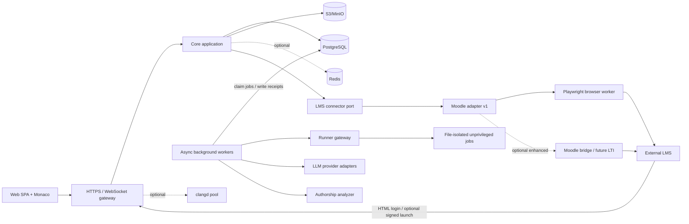

# Целевая архитектура и стек

> Статус: FastAPI modular monolith, PostgreSQL, two durable workers,
> Playwright-first pluginless Moodle adapter, опциональный bridge 0.3 и отдельный
> runner реализованы. Диаграммы/потоки ниже включают будущие S3, Redis,
> WebSocket, LTI и clangd; их наличие в схеме не означает наличие в compose или
> коде baseline.

## 1. Архитектурный стиль

Рекомендуется **модульный монолит** для бизнес-системы и отдельные процессы только там, где есть самостоятельная граница безопасности или масштабирования:

- основное web/API-приложение;
- realtime-канал истории и presence;
- фоновые workers;
- отдельный Linux runner-контейнер; текущий ordinary subprocess не находится в
  web/worker-процессе, но не имеет per-job filesystem/network sandbox;
- опциональный clangd/LSP-пул;
- слой LMS-коннекторов; первый adapter использует отдельный bounded Playwright
  browser-worker, а bridge является опциональным расширением;
- внешние LLM и анализатор авторства через адаптеры.

Это проще согласовать, тестировать и эксплуатировать, чем набор ранних микросервисов. Логическая граница runner обязательна для контроля файлов и ресурсов; усиленная kernel boundary сознательно отложена.

Целевая (не текущая deployment) диаграмма:

## 2. Модули основного приложения

Это целевая декомпозиция. Baseline группирует её в FastAPI routers,
`models`/`schemas`/`services` и два worker modules; отдельных packages для
каждого пункта, integration inbox/conflict engine и notifications пока нет:

1. `identity` — внешние principal projections, transient Moodle credential
   login через browser-worker, encrypted leased `storage_state`, server sessions
   и administrative elevation; без регистрации и локальных паролей.
2. `system_settings` — глобальные политики, квоты, подключения и версии административного токена.
3. `courses` — внешние проекции курсов, секции, группы, memberships и локальные visibility assignments.
4. `task_bank` — категории, задания, версии, файлы, тесты и рубрики.
5. `assessments` — работы, варианты, окна, правила, назначения.
6. `attempts` — state machine попытки, дедлайн, сдача, переоткрытие.
7. `workspace` — файлы, события, снимки, внутренний clipboard.
8. `execution` — build/run requests и результаты runner.
9. `review` — claims, черновики, решения, история оценок.
10. `decision_support` — агрегирование свидетельств, без финального вердикта.
11. `ai` — chats, prompt/policy versions, provider calls, citations.
12. `similarity` — плагиат, кандидаты, пары, кейсы.
13. `authorship` — экспорт истории и внешние analysis jobs.
14. `integrations` — общий LMS connector port, mappings, outbox, inbox и conflicts; `integrations.moodle` — первый adapter.
15. `audit` — неизменяемый журнал значимых действий.
16. `notifications` — in-app и e-mail, но не критический путь экзамена.

Модули общаются через публичные application services и доменные события. Прямой доступ к таблицам другого модуля запрещается на уровне соглашения и code review.

### 2.1. Целевой контракт LMS-коннектора

Baseline уже изолирует Moodle URL recognition, Playwright credential login,
course/roster/activity snapshots, Quiz Essay attachment/online-text sync, исторический
импорт и grade/comment write в adapter. Запись решения использует штатную форму
конкретного Assignment либо Quiz Essay и durable outbox; независимый read-back
и conflict engine остаются target. Опциональный bridge добавляет signed launch,
task mirror и внешние checkpoints.
Полный переносимый port ниже — следующий контракт: native task pull, assessment
push, change subscription, inbox/conflicts и второй adapter ещё не реализованы.

Core должен зависеть от интерфейса, а не от Moodle. Минимальные операции target:

- `recognizeCourseUrl` — распознать разрешённый URL и получить непротиворечивый внешний locator без сетевого запроса к произвольному host;
- `authenticateWithCredentials`/`logout` — transient browser login без
  сохранения внешнего пароля и выдача подтверждённого external subject;
  connector может вместо этого реализовать delegated launch;
- `resolveCourseAccess` — подтвердить enrolment и scope групп для текущего
  course; глобальная роль определяется локальным teacher-token grant, а не LMS;
- `discoverCourse` — вернуть capability report, метаданные, секции и активности;
- `listMemberships`/`listGroups` — полные или дельта-снимки состава;
- `pullTaskBank`/`pushTaskVersion` — future: импорт и синхронизация поддерживаемых элементов банка;
- `pullSchedule` — read-only окна, лимиты, балл и попытки; `pushAssessment` не
  используется текущей Moodle-owned моделью;
- `pushCheckpoint`/`pushReviewDecision` — кодовые контрольные точки, оценка и комментарий;
- `subscribeChanges`/`reconcile` — подписанные события и периодическая сверка;
- `capabilities`/`health` — версия, поддерживаемые свойства и состояние.

Все DTO коннектора версионируются и используют стабильные внешние IDs.
Неизвестная возможность возвращается как `UNSUPPORTED`. Playwright parser
принимает только известные exact-origin routes и fail-closed contracts, а не
произвольные URL/selectors/JavaScript; постоянного context на пользователя нет.
Pluginless Moodle доставляет ответ однозначно mapped Quiz Essay или стандартного
Assignment. Поддерживаются attachment/file и online-text transport; при двух
включённых Assignment plugins предпочтителен file transport. Connector не
переносит task-bank mirror или compiler/history data. Локальный task-bank UI скрыт:
публикация импортированной работы означает только выбор Moodle-групп, а
название, условие, сроки, максимальный балл и число попыток всегда принадлежат
Moodle. Moodle-specific типы, URL и capabilities заканчиваются внутри адаптера.

### 2.2. Bootstrap-инвариант

Поскольку локального администратора и локального входа нет, минимум одно LMS
connection provisioned оператором командой `bootstrap-connection`: canonical
HTTPS origin и adapter mode. Pluginless default не требует общего Moodle
service token или bridge key; после успешного входа сохраняется только
AES-GCM encrypted browser `storage_state` kind `BROWSER_STATE_V1`. Admin token не может
самостоятельно создать первую аутентифицированную сессию. В baseline elevated
UI меняет `allowed_lms_origins` и feature/policy settings, но не CRUD самого
`LMSConnection`; connector CRUD и LTI metadata остаются target.

Непустой `allowed_lms_origins` из system settings является дополнительным
пересечением с origins включённых connection records при импорте course URL;
пустой список оставляет connection records авторитетными. Он не расширяет
bootstrap connections.

## 3. Рекомендуемый стек

Frontend имеет committed `package-lock.json`. Backend/runner Python зависимости
сейчас заданы диапазонами в requirements/pyproject без полноценного exact/hash
lock, поэтому воспроизводимый Python lock/SBOM остаётся production gate. Ниже —
целевые ветки, а не разрешение автоматически брать `latest`.

### 3.1. Frontend

Фактический baseline использует React 18, TypeScript, Vite, React Router,
Monaco, Vitest и Testing Library. TanStack Query, React Hook Form/Zod, Zustand,
WebSocket и Dexie/IndexedDB в зависимостях ещё отсутствуют; строки ниже для них
являются выбором следующей фазы.

| Область | Выбор | Причина |
| --- | --- | --- |
| Язык | TypeScript strict | типизированные API и события редактора |
| UI | React + Vite | SPA без требований SEO; зрелая экосистема Monaco |
| IDE | Monaco Editor | multi-model, diff, diagnostics, completion APIs, события изменения модели |
| Server state | TanStack Query | кеш, retry, invalidation, optimistic UI |
| Routing | TanStack Router или React Router | типизированные маршруты; выбрать один в ADR |
| Формы | React Hook Form + Zod | единая клиентская валидация контрактов |
| Локальное состояние | Zustand | небольшие предсказуемые stores, без глобального монолита |
| Realtime | нативный WebSocket с протоколом приложения | контроль sequence/ack/backpressure |
| Локальная очередь | IndexedDB через Dexie | восстановление неподтверждённых операций |
| Unit/component tests | Vitest + Testing Library | быстрый feedback |
| E2E | Playwright | тесты браузера; не Moodle-синхронизация |

Monaco предоставляет событие изменения содержимого модели и API completion/diagnostics. Полноценной семантики C++ в самом Monaco нет: это зона clangd или упрощённого индексатора.

### 3.2. Backend

| Область | Выбор | Причина |
| --- | --- | --- |
| Язык | Python 3.12+; backend image 3.13 | совпадает с `pyproject.toml` и Dockerfile |
| Framework | FastAPI/Starlette | async ASGI API, dependency injection, WebSocket и нативный OpenAPI |
| Контракты | Pydantic v2 | отдельные request/response/settings models и строгая валидация на границах |
| ORM | SQLAlchemy 2 async | явные repositories/Unit of Work, PostgreSQL row locks и отсутствие зависимости домена от framework |
| Миграции | Alembic | versioned schema/data revisions; только committed migrations в deployment |
| ASGI server | Uvicorn | backend допускает `WEB_CONCURRENCY`; runner намеренно один worker из-за process-local nonce cache |
| Jobs | отдельные asyncio worker modules | PostgreSQL outbox/jobs, lease, retry и `FOR UPDATE SKIP LOCKED`; не `BackgroundTasks` для durable work |
| DB driver | asyncpg | PostgreSQL driver через SQLAlchemy async engine |
| Auth | Playwright LMS login + server session | нет локальных паролей и регистрации; Moodle default — transient HTML-form login + encrypted browser state, bridge launch optional, LTI — target |
| Policy | две внешние роли + resource ABAC + session elevation | `STUDENT`/`TEACHER`, группы из LMS; global settings только после admin token step-up |

FastAPI routers отвечают только за transport, Pydantic models — за внешний контракт, а domain/application services не импортируют HTTP-объекты. SQLAlchemy entities не сериализуются напрямую: response model формируется явно, чтобы student representation не раскрывал hidden tests, внутренние policy или внешние identifiers.

Один `AsyncSession` создаётся на один HTTP request либо одну worker iteration и не разделяется между параллельными asyncio tasks. Запись выполняется внутри явного `async with session.begin()`. Для state-machine переходов используется optimistic revision и, где нужна сериализация, `select(...).with_for_update()`. Outbox workers получают небольшие пакеты через `with_for_update(skip_locked=True)`, фиксируют lease и освобождают транзакцию до любого Moodle/AI/runner HTTP-вызова. Результат внешнего вызова записывается новой короткой транзакцией с повторной проверкой lease/state/idempotency key.

Планировщик запускается отдельным `python -m app.workers.scheduler` и выбирает
единственного активного исполнителя через PostgreSQL advisory lock. Доставщик
`python -m app.workers.sync` допускает несколько экземпляров при атомарном row
claim. Именно deadline и Moodle outbox являются durable worker flows. Runner,
AI и authorship baseline вызываются синхронно из FastAPI request flow и
записываются после внешнего ответа; durable очереди для них ещё нет.

### 3.3. Данные

| Хранилище | Назначение |
| --- | --- |
| PostgreSQL 17+ | транзакционные данные, код, snapshots, event metadata, audit, review, mappings |
| S3-compatible storage, в будущем | крупные artifacts/source bundles после появления отдельной политики хранения |
| Redis, опционально | presence, rate limits и ephemeral cache; не источник бизнес-состояния |
| pgvector, опционально | candidate retrieval для сходства; не источник вердикта |

Redis никогда не является единственным хранилищем попытки, оценки или задания.

### 3.4. C/C++ tooling

- GCC и Clang в версионированном runner image;
- baseline profiles: C17 и C++20, GCC/Clang, single/multi; C++17/23 не
  зарегистрированы;
- baseline генерирует прямую compile/link команду; CMake/Ninja отсутствуют;
- clangd для семантических подсказок во второй итерации;
- clang-tidy, Clang Static Analyzer, ASan/UBSan как независимые свидетельства;
- GoogleTest/Catch2 только в преподавательском harness, скрытом от попытки;
- Tree-sitter C/C++ или libclang для анализа структуры и плагиата.

### 3.5. Runner и временный unrestricted-режим

Текущая реализация — обычный compiler/program subprocess внутри отдельного
runner Docker-контейнера. Bubblewrap отключён; backend принимает и сохраняет
`filesystem_isolated=false`, `network=host`. `FILESYSTEM_ONLY` ниже является
целевым усилением, а не фактическим baseline.

- runner — отдельный непривилегированный service/process; student binary никогда не становится дочерним процессом Uvicorn либо application worker;
- контейнер не получает application/DB/Moodle/LLM mounts или Docker socket;
- subprocess использует очищенный environment, unique working directory и гарантированный cleanup, но может читать другие доступные runner-контейнеру пути;
- CPU/wall time, memory, PIDs, workspace и output limits остаются обязательны для защиты доступности от ошибок и бесконечных программ;
- network в interim baseline доступна в пределах сети runner-контейнера;
- immutable toolchain bundles/images и SBOM обеспечивают воспроизводимость.

Фраза «нет доступа к другим файлам» не может означать буквально нулевое чтение: компилятору нужны executable, headers и libraries, а программе — loader/runtime libraries. Контракт означает allow-list этих read-only объектов плюс private job workspace. При совместном kernel с core сохраняется риск kernel/runtime escape; он принят для v1 и может быть позднее снижен профилем gVisor/microVM.

### 3.6. Интеграции и наблюдаемость

Из перечисленного ниже baseline реализует bounded Moodle Playwright adapter,
AES-GCM encrypted leased browser state, опциональный narrow bridge/HMAC launch и
AI/authorship HTTP adapters. LTI Advantage,
OpenTelemetry stack, Vault/SOPS integration и native question-bank APIs — target.

- общий LMS connector port и conformance test kit для будущих адаптеров;
- Moodle LTI 1.3 Advantage: launch, roles/context, NRPS, AGS, Deep Linking;
- Moodle local plugin для внешнего входа из оболочки, native Quiz/Assignment, comments, question bank и webhooks;
- OpenAI Responses API, локальная модель или OpenAI-compatible provider через единый интерфейс;
- OpenTelemetry traces/metrics/log correlation;
- Prometheus + Grafana, Loki/OpenSearch для логов, Sentry-compatible error tracker;
- Vault/SOPS/Kubernetes Secrets с внешним KMS для секретов;
- GitHub/GitLab CI с SAST, dependency scanning, container scanning и migration tests.

## 4. Потоки данных

### 4.1. Вход и добавление курса

Текущий Moodle default использует отдельный внутренний Playwright
browser-worker, не browser redirect и не LTI. Пароль существует только в теле
одного HTTPS-запроса к core и HMAC-подписанного internal login request; он не
сохраняется после операции.

1. Пользователь выбирает заранее настроенное enabled подключение; первый adapter
   — Moodle, а ожидаемая университетская запись указывает на
   `edu.mmcs.sfedu.ru`. Схема и CLI не ограничивают deployment ровно одной
   записью `LMSConnection`.
2. Браузер отправляет Moodle username/password и необязательные teacher/admin
   tokens в HTTPS body core. Moodle-пароль исключён из persistence, logs и
   telemetry. Два токена приложения после успешной проверки могут оставаться
   origin-scoped в `localStorage` этого браузера для скрытого предзаполнения;
   пользователь может удалить их на экране входа.
3. Core передаёт credentials только `moodle-browser`; worker открывает штатную
   HTML login form exact configured Moodle origin, проверяет authenticated
   identity и возвращает sanitized Playwright `storage_state`.
4. Core передаёт worker только numeric ID курсов из глобального каталога,
   управляемого через `SYSTEM_SETTINGS`. Moodle dashboard не расширяет этот
   allow-list. Для этих ID worker подтверждает `STUDENT`/`TEACHER` по точным
   course pages; неизвестная роль не создаёт membership.
5. `storage_state` шифруется AES-GCM с отдельным deployment key и associated
   data `(connection, principal, BROWSER_STATE_V1)`; browser пользователя
   получает только HttpOnly session cookie core. Credential revision/lease
   защищают обновление state между операциями. Роли `STUDENT`/`TEACHER`
   выводятся из Moodle course controls/roster, а не из UI.
6. Если введён корректный admin token, core добавляет `SYSTEM_SETTINGS` с expiry,
   но не меняет внешнюю роль. После idle/absolute expiry страница настроек
   запрашивает тот же token повторно и создаёт новое elevation, не заставляя
   пользователя повторять Moodle-вход. Bridge mode может быть provisioned
   отдельно и тогда использует прежний signed launch/callback вместо
   credentials endpoint.
7. Principal с временной `SYSTEM_SETTINGS` elevation отправляет ссылку на курс
   из системных настроек. Это bootstrap-gate до
   создания local membership, а не третья роль. Core разрешает только origin
   настроенного подключения; adapter извлекает course ID и дополнительно
   подтверждает actor как `TEACHER` целевого course во внешних данных.
8. Discovery job получает bounded данные через Playwright либо optional bridge,
   строит preview и capability report. После подтверждения создаётся local
   course projection и mappings.

### 4.2. Редактирование

Это целевой realtime flow. В baseline Monaco последовательно отправляет REST
replacement, сервер вычисляет semantic delta и сохраняет snapshot в PostgreSQL;
очередь frontend находится в памяти, S3/IndexedDB/WebSocket не используются.

1. Браузер открывает попытку и получает `workspace_revision`.
2. Monaco формирует семантические изменения.
3. Клиент пакетирует операции, присваивает локальные номера и отправляет по WebSocket.
4. Сервер проверяет attempt state, sequence, размер и разрешённый тип операции.
5. PostgreSQL фиксирует события и новый hash; сервер отвечает ack.
6. Через порог операций или времени создаётся snapshot в S3.
7. Клиент удаляет подтверждённые операции из IndexedDB.

### 4.3. Запуск

1. Core фиксирует source snapshot и создаёт persisted run request.
2. В baseline тот же FastAPI request синхронно отправляет bundle в runner
   gateway; отдельная durable run queue — target.
3. Runner стартует один непривилегированный file-isolated job с конкретным digest toolchain bundle/image.
4. Compile и run выполняются с разными лимитами.
5. Артефакты и нормализованный результат возвращаются, private job workspace уничтожается.
6. Core связывает результат с exact snapshot hash.

Для official hidden-test evidence baseline повторяет этот synchronous flow для
каждого из 1–20 cases по immutable submission, но хранит отдельный durable
`EvidenceReport` с partial outcomes. Active claim/policy, total/per-case timeout,
per-teacher budget и isolation/no-network flags проверяются core; runner остаётся
stateless и не знает grade или скрытость stdin.

### 4.4. Синхронизация LMS

В baseline нет inbound webhook/inbox или LTI. Scheduled `course.sync` читает
доступные course/roster/activity snapshots через Playwright. В pluginless mode
explicit mapped `mod_quiz` с ровно одним Essay получает полный single-file
source через `ESSAY_ONLINE_TEXT` либо single-file source/deterministic
multi-file ZIP через `ESSAY_ATTACHMENT`. Artifact ограничен 4 MiB,
internal base64/JSON request — 6 MiB; `PERIODIC`/`FINAL_MINUTE` дают
`DRAFT_SAVED`, `SUBMISSION`/`DEADLINE` — `FINALIZED`. Task-version mirror event
не enqueue-ится. Для стандартного Assignment фактическая student form повторно
доказывает `ASSIGN_FILE` либо `ASSIGN_ONLINE_TEXT`; file transport отправляет
один source как `main.c`/`main.cpp`, а любой многофайловый набор — как
детерминированный `submission.zip`. Исторические сдачи обоих типов читаются
постранично. Grade/comment доставляется через Playwright для однозначно
адресованного Assignment либо Quiz Essay; optional bridge добавляет внешние
recovery checkpoints и task-version mirrors.

Фактический flow: browser identity создаёт/находит external principal;
`course.sync` обновляет projections; локальная mutation атомарно создаёт outbox
row; sync worker получает короткий DB lease, выполняет HMAC browser request без
row lock и сохраняет bounded receipt/refreshed encrypted state. Local snapshot
остаётся authoritative, а retry использует тот же idempotency intent. Для
grade/comment есть Playwright delivery, но независимый external read-back и
полный conflict engine пока отсутствуют.
Inbound webhook/inbox, delta-version checks и conflict UI — target.

## 5. Масштабирование

### 5.1. Целевой начальный production (не текущий Compose)

- 2 экземпляра FastAPI/Uvicorn за reverse proxy после проверки общего session/replay state;
- один scheduler process (active экземпляр выбирается advisory lock) и один или несколько sync workers;
- PostgreSQL job/outbox tables с отдельными типами `critical-sync`, `runner`, `ai`, `similarity`, `exports`; внешний broker вводится только после подтверждённой необходимости;
- минимум 2 runner instances для доступности; физически отдельные nodes рекомендуются, но не являются условием принятого v1 risk profile;
- PostgreSQL primary + ежедневные full и непрерывные WAL backups;
- объектное хранилище с versioning;
- Redis с репликацией при необходимости; он не участвует в commit попытки или оценки;
- мониторинг возраста oldest pending job, lease recovery, retry exhaustion и dead-letter состояния в PostgreSQL.

### 5.2. History ingest

При 100 студентах и пяти операциях в секунду получается около 500 событий/с. Это умеренная нагрузка для PostgreSQL при batch insert и партиционировании. Не следует вводить Kafka до подтверждения нагрузочным тестом. Условия перехода на отдельный event-ingest service:

- устойчиво более 3–5 тысяч событий/с;
- несколько университетов с раздельными SLO;
- latency ack выходит за 300–500 мс при исправной БД;
- архивирование создаёт заметный lock/IO pressure.

### 5.3. clangd

Один процесс clangd на каждую из 100 попыток может потребовать неприемлемую память. Этапы:

1. Monaco syntax + word-based completion и symbol index текущего workspace.
2. Пул clangd с idle timeout и жёсткой памятью для лабораторных.
3. Предварительно прогретые pods для экзамена, если нагрузочный тест подтвердит бюджет.

Полноценный LSP не является условием запуска MVP.

## 6. Архитектурные запреты

- основной backend не имеет Docker socket и не запускает student binaries;
- runner не имеет Moodle/LLM/DB credentials;
- LLM не получает инструмент произвольного запуска shell;
- Moodle HTML разбирается только отдельным `moodle-browser` по узким
  exact-origin contracts; core не принимает произвольные URL/selectors/scripts,
  а persistent browser contexts на пользователей отсутствуют;
- core не хранит локальные пароли, не содержит регистрацию и не позволяет вручную назначить `STUDENT`/`TEACHER`;
- административный токен не принимается как самостоятельная аутентификация и не передаётся в bearer header прикладных запросов;
- URL курса не загружается универсальным HTTP-клиентом: host/port/scheme сопоставляются заранее настроенному connector, иначе запрос отклоняется;
- фоновые schedulers не стартуют внутри каждого web worker;
- бизнес-критичная блокировка не хранится только в памяти процесса;
- события истории не принимаются с клиентским timestamp как единственным доказательством времени;
- опубликованные task versions не изменяются inplace;
- оценка не отправляется в Moodle в той же транзакции, что и UI-запрос; используется outbox.

## 7. Основные ADR, которые нужно создать при реализации

1. FastAPI/Pydantic v2/SQLAlchemy 2/Alembic и стратегия совместимых обновлений.
2. React routing/state libraries.
3. File-isolation executor v1, network profile и условия перехода к gVisor/microVM.
4. PostgreSQL job/outbox reliability profile и измеримые условия добавления внешнего broker.
5. Формат history event и canonical hashing.
6. Версия generic LMS connector contract и conformance kit.
7. LTI library или собственная реализация с conformance tests.
8. Moodle Playwright login, AES-GCM browser-state lease/revision lifecycle и
   optional bridge mode.
9. Жизненный цикл административного токена и срок session elevation.
10. Источник истины банка заданий.
11. Политика хранения ИИ и истории.
12. C++ build profiles и доступные стандарты.
13. Порог перехода от word completion к clangd.

## 8. Основные источники для реализации

- [FastAPI documentation](https://fastapi.tiangolo.com/)
- [Pydantic v2 models](https://docs.pydantic.dev/latest/concepts/models/)
- [SQLAlchemy asyncio](https://docs.sqlalchemy.org/en/20/orm/extensions/asyncio.html)
- [SQLAlchemy `FOR UPDATE`](https://docs.sqlalchemy.org/en/20/core/selectable.html#sqlalchemy.sql.expression.Select.with_for_update)
- [Alembic tutorial](https://alembic.sqlalchemy.org/en/latest/tutorial.html)
- [Monaco Editor API](https://microsoft.github.io/monaco-editor/typedoc/)
- [clangd features](https://clangd.llvm.org/features)
- [clangd compile commands](https://clangd.llvm.org/design/compile-commands)
- [gVisor security model](https://gvisor.dev/docs/architecture_guide/security/) — опциональное последующее усиление
- [LTI Advantage implementation guide](https://standards.1edtech.org/lti/guides/implementation_guide/implementation-guide)
