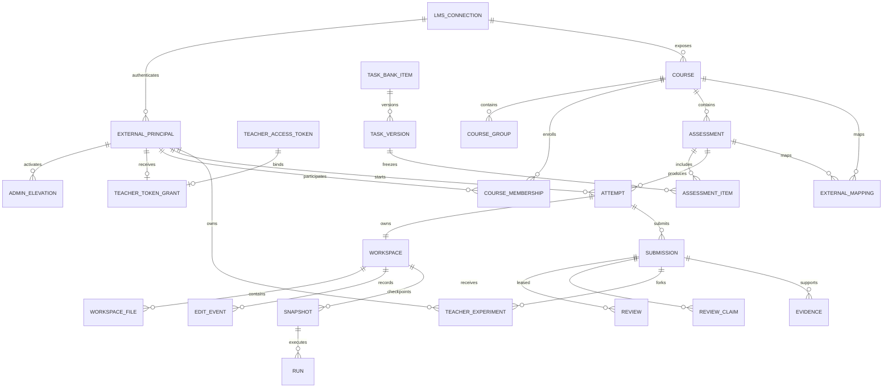

# Доменная модель и хранение данных

> Статус: SQLAlchemy-модель и Alembic baseline реализованы в PostgreSQL. В
> текущем срезе исходники, snapshots и JSON evidence также лежат в PostgreSQL;
> S3/MinIO, партиционирование и retention jobs ниже являются целевой эволюцией.
> Разделы 3–13 описывают логическую модель-супермножество: наличие заголовка или
> поля там не означает наличие отдельной таблицы/API в baseline.

Точный baseline schema задают `backend/app/models/` и committed Alembic
migrations. В нём уже есть principals/sessions/elevations, пул
`TeacherAccessToken` и one-to-one grants, LMS/course projection,
task versions/assessments/availability, attempts/workspaces/events/snapshots/runs,
submissions/review/experiments/chats, authorship/similarity/plagiarism,
`ExternalMapping`, `SyncOutbox`, settings/audit и persisted deterministic
`EvidenceReport`. Отдельных `integration_credential`, `test_suite_version`,
`rubric_version`, `assessment_override`, `ai_analysis`, `sync_inbox` и
`sync_conflict` пока нет; соответствующие описания ниже — target. Baseline
хранит hidden-test manifest прямо в `TaskVersion`, criterion scores — в
review draft/decision, а connector secrets — в deployment secret/env.

## 1. Правила моделирования

- Внутренние primary keys — UUIDv7 или UUIDv4; Moodle ID не становится primary key.
- Все внешние объекты связаны через `external_mapping` с provider, scope, external ID и external revision.
- Локальная запись личности является проекцией внешнего principal, а не отдельной учётной записью; пароль, registration state и свободно редактируемое role field отсутствуют.
- Допустимые прикладные роли ровно две — `STUDENT` и `TEACHER`. Глобальная роль principal выводится из активной `teacher_token_grant`: grant есть — `TEACHER`, нет — `STUDENT`. LMS role в этом выводе не участвует.
- Course membership материализует эту глобальную роль только в области пересечения активного глобального каталога и актуального LMS-enrolment/group scope.
- Administrative elevation относится к серверной сессии, а не к глобальной роли principal или course scope.
- Любое оценивание и настройка имеет автора, источник и версию.
- Временные состояния попытки меняются только через state machine.
- Целевая модель выносит крупные blobs по content hash в S3; baseline хранит
  bounded source/snapshot payloads в PostgreSQL (workspace: 64 файла/512 KiB,
  Moodle checkpoint: до 4 MiB).
- Soft delete разрешён для учебных сущностей; audit и submitted snapshots не удаляются обычным UI.
- Persistence mapping выполняется SQLAlchemy 2 declarative models, а внешние структуры — отдельными Pydantic v2 schemas; ORM entity не является API-контрактом.
- Схему изменяют только committed Alembic revisions. `metadata.create_all()` допустим лишь в изолированном тестовом bootstrap и не заменяет migration в deployment.
- Один `AsyncSession` принадлежит одной request/worker task. State-machine transitions используют короткую транзакцию, optimistic revision и при необходимости PostgreSQL row lock; сетевые вызовы внутри такого lock запрещены.

## 2. Контекстная диаграмма данных

Диаграмма сокращена: chats, plagiarism, authorship и sync вынесены ниже.

## 3. Внешняя идентичность, глобальная роль и administrative elevation

### `external_principal`

- внутренний UUID только для ссылочной целостности;
- `lms_connection_id` + immutable external subject/user ID — уникальная пара;
- отображаемое имя, locale и минимальные разрешённые профильные поля как cache;
- external status и profile revision;
- last successful login и assurance metadata;
- пользовательские accessibility/UI preferences, не меняющие внешний профиль.

Здесь нет username/password hash, приглашения, активации, локального e-mail login или role column. Запись появляется только после подписанного callback/launch либо подтверждённого connector import. Сопоставление по ФИО запрещено; e-mail может быть лишь подтверждённой подсказкой миграции. Одна и та же персона в двух LMS по умолчанию имеет две разные проекции, пока не утверждена отдельная федеративная схема.

### `teacher_access_token`

- несекретный `public_id`, административная label, Argon2id `secret_hash` и
  nullable AES-GCM `encrypted_secret`; ciphertext привязан к ID строки как AAD;
- creator principal, created/last-used timestamps и счётчик применений;
- list metadata возвращает `can_reveal`, но никогда не возвращает raw token;
- создание генерирует восемь ASCII-букв/цифр и сохраняет одновременно hash и
  ciphertext; явное раскрытие расшифровывает secret только для `SYSTEM_SETTINGS`,
  отдаёт его с `no-store` и аудируется;
- замена принимает ровно восемь ASCII-букв/цифр, атомарно обновляет hash и
  ciphertext, сохраняет существующий grant и аудируется без secret material;
- legacy hash-only строки имеют `encrypted_secret=NULL`: их нельзя раскрыть, но
  известные восьмизначные URL-safe и структурированные токены продолжают
  проверяться до замены/удаления;
- создание, list metadata, раскрытие, замена и удаление требуют
  `SYSTEM_SETTINGS`; удаление отзывает grant.

### `teacher_token_grant`

- `token_id` и `principal_id` имеют независимые unique constraints: один токен на один principal и не более одного токена на principal;
- grant создаётся при первом успешном LMS-входе с этим токеном, затем обычные входы находят grant по principal;
- grant живёт до удаления самого токена. Удаление каскадно удаляет grant, деактивирует связанные `TEACHER` memberships и восстанавливает `STUDENT` projection внутри допущенного course scope;
- это единственный источник глобального `TEACHER`; Moodle role/control markup не создаёт grant.

### `course_membership`

- principal и course;
- role enum: только `STUDENT` или `TEACHER`;
- внешние group IDs/scopes;
- enrolment state и validity interval;
- external revision и время последней сверки.

Membership нельзя создать или отредактировать public local API. Connector проецирует только identity/enrolment/groups для курсов из глобального каталога, а поле `role` материализует глобальный teacher grant или student default. Даже если LMS возвращает role/capability metadata, эти данные не повышают principal до `TEACHER`.

### `admin_elevation`

- server session ID и authenticated external principal;
- admin key version/ID, но не сам токен и не его hash;
- granted/expires/revoked timestamps;
- login transaction/request/audit references;
- coarse IP и user-agent change markers.

Elevation даёт только системные capabilities. Оно не превращает `STUDENT` в
`TEACHER` и не расширяет course membership. Baseline прекращает его при logout,
явном session revoke/drop, timeout или смене client network prefix (`/24` IPv4,
`/64` IPv6); при смене префикса LMS-сессия остаётся действующей. Автоматический
revoke по rotation/key version ещё не реализован. User-agent hash относится к
server session; отдельного user-agent marker в текущей elevation row нет.

### `moodle_credential`

Baseline хранит для пары connection/principal только AES-GCM encrypted
credential kind `BROWSER_STATE_V1`, а не Moodle password. Запись содержит
status, revision, lease owner/expiry, last use/verification и bounded metadata;
associated data шифрования связывает ciphertext с connection, principal и kind.
Legacy `MOBILE_TOKEN` остаётся только для миграционной совместимости. Общие HMAC
и provider secrets поступают из deployment env/secret injection; credential не
входит в principals и не получает роль.

## 4. Курсы и состав

### `course`

- обязательные LMS connection/external course ID, code, title, academic period;
- default language/C++ standard/timezone;
- status discovered/importing/active/sync_error/archived;
- `catalog_enabled` и `catalog_added_at`: глобальный административный allow-list,
  независимый от глобальной роли и teacher-token grant конкретного пользователя;
- source-of-truth policy;
- default assessment and AI policies;
- capability snapshot и external mapping.

Курс не создаётся с нуля: production-запись возникает из подтверждённого
`course_import_job` для URL внешнего курса. До confirm она остаётся
`catalog_enabled=false` и не может дать session role либо доступ к course API.
Удаление из каталога выключает memberships, но не удаляет учебную историю.

### `course_import_job`

Submitted URL hash/redacted URL, connection, parsed external locator, requesting
administrator principal, discovery snapshot, capability report, mapping preview,
state, errors and confirmation revision. Исходный URL никогда не вызывает
произвольный fetch: adapter сначала сопоставляет scheme/host/port с connection
allow-list. Создание и confirm требуют `SYSTEM_SETTINGS`.

### `course_section`

Иерархия разделов с position, visibility, external revision и sync status.

### `course_group`

Группа/подгруппа/комиссия. Поля: name, kind, parent, external ID, active interval. Допустимый набор студентов для principal с teacher-token grant определяется внешними enrolments/groups внутри каталога, а не строкой в названии и не локальным назначением.

### `availability_assignment`

Локальное правило включения программной оболочки: assessment, Moodle group,
allowed/denied и author principal. Оно определяет, каким группам показывается
IDE для уже существующей activity, но не создаёт enrolment, не расширяет catalog
scope, не меняет глобальную роль и не записывается в Moodle. Временных override
здесь нет: open/close, timelimit, максимальный балл и число попыток всегда
повторно проецируются из Moodle.

## 5. Банк заданий — отложенная внутренняя модель

Следующие сущности существуют как технический задел, но их UI скрыт и они не
участвуют в публикации импортированной Moodle activity. До появления
подтверждённого Moodle write contract canonical задание находится в Moodle, а
локальная «публикация» означает только включение IDE для выбранных групп.

### `task_bank_item`

Стабильная сущность: scope (`SYSTEM` или внешний course), category, slug, tags, visibility, current draft/published version.

### `task_version`

- immutable version number;
- title, statement content ref и attachments;
- language + standard;
- single/multi-file mode;
- starter workspace template ref;
- generated build profile;
- public examples, hidden tests, rubric refs;
- max score and difficulty;
- AI/tutor policy hints;
- variant generator/version, если используется;
- author/reviewer/publish timestamps;
- content hash и status.

### `test_suite_version` (target)

Отдельно версионируется, потому что исправление скрытого теста не всегда должно менять условие. Любой результат run хранит оба hash: task version и test suite version.

### `rubric_version` (target)

Критерии, веса, описания уровней и максимальные баллы. Рубрика неизменяема после использования; teacher decision ссылается на версию.

## 6. Работы и назначения

### `assessment`

- course/section;
- type: lab/independent/control/exam;
- Moodle-owned read-only title/instructions;
- Moodle-owned open/close window и duration;
- Moodle-owned attempt count и grade scale/max score;
- локальный выбор Moodle-групп, которым включена оболочка;
- paste policy;
- student/teacher AI policies;
- autosubmit/checkpoint policy;
- review claim granularity;
- publication status;
- LMS mapping and sync owner.

### `assessment_item`

Внутренняя/deferred связь с локальной task version. Для импортированной Moodle
activity в текущем продукте не назначается и не подменяет Moodle question/slot.
Будущий банк может использовать fixed/random/group-based rules только после
отдельного интеграционного контракта.

### `assessment_override` (не используется для Moodle-owned сроков)

Дополнительное время, отдельное окно и число попыток настраиваются в Moodle и
могут только проецироваться connector. Локальный override этих полей запрещён.
Отдельные правила доступности AI/IDE относятся к policy оболочки, а не к
Moodle attempt limits.

## 7. Попытка и рабочее пространство

### `attempt`

- assessment, external principal, assigned items;
- state: `NOT_STARTED`, `ACTIVE`, `FINISHING`, `SUBMITTED`, `AUTO_SUBMITTED`, `LOCKED`, `VOID`;
- started/expected end/deadline using server clock и импортированные Moodle
  ограничения;
- current acknowledged workspace revision;
- final snapshot ID;
- reconnect/session metadata;
- integrity policy version;
- submission source/manual or deadline;
- reopen count and reason.

Допустимые переходы задаются в коде и тестируются. Из `SUBMITTED` нельзя вернуться в `ACTIVE` без привилегированной операции `reopen`, создающей новую attempt epoch.

### `workspace`

Attempt ID, current revision/hash, file mode, aggregate size, event chain head, latest snapshot.

### `workspace_file`

Stable file ID, normalized relative path, language, created/deleted revisions, current content ref/hash. Path не содержит `..`, абсолютных сегментов, NUL, device names или symlink semantics.

### `edit_event`

- event ID, workspace, attempt epoch;
- server sequence and server received time;
- optional client monotonic time;
- type/source;
- file ID and normalized changes;
- previous/current document version;
- previous event hash and current event hash;
- client instance ID, request idempotency key;
- clipboard/completion origin reference;
- server validation result.

### `snapshot`

Revision, event chain head, manifest content ref/hash, reason, created time. Manifest перечисляет path, mode, size и content hash каждого файла.

## 8. Сдача и проверка

### `submission`

Immutable attempt final snapshot, submitted time, source, late flag, LMS export state and external receipt. Повторная отправка создаёт новую submission revision только после официального reopen.

### `review_claim`

- submission или item;
- owner;
- mode read/write;
- lease expiration + heartbeat;
- state active/released/expired/overridden;
- takeover reason.

Для write claim действует уникальность по target. Чтение параллельно разрешено.

### `review_draft`

Private teacher draft с revision для optimistic concurrency. Не является оценкой и не экспортируется.

### `teacher_experiment`

Отдельная редактируемая песочница преподавателя: owner external principal, base submission/snapshot hash, private workspace/snapshot, current revision, expiry, reset/deleted timestamps. Она никогда не заменяет submission, не входит в student edit history и не экспортируется в LMS. Compile/run results имеют origin `TEACHER_EXPERIMENT` и ссылаются одновременно на base submission и exact experiment revision.

### `review_decision`

- submission и reviewer;
- final grade/comment и opaque JSON `criterion_scores`;
- validated `evidence_ids`;
- immutable decision revision и `supersedes_id`;
- LMS export state через отдельный outbox.

Изменение оценки создаёт новую decision revision и не переписывает предыдущую.
Отдельного `rubric_version`, applied/voided state и decision-level digital hash в
baseline нет; это целевое расширение.

Teacher-facing submission projection содержит последнее решение и полную
историю revisions. Список дополнительно возвращает вычисленный `can_review`:
обычный преподаватель получает его только для студентов из назначенного
`CourseGroup`, а actor с `SYSTEM_SETTINGS` может прочитать любую локальную
submission, но без права создавать claim/draft/experiment/decision.

### `evidence_report` (baseline)

Один persisted teacher-only запуск скрытых тестов фиксирует immutable
submission/snapshot/task version, requester, hashes hidden-test manifest/task/
snapshot, status `RUNNING|COMPLETED|FAILED`, passed/total counts, bounded
per-case outcomes/findings, failure и timestamps. Case outcome ссылается на
отдельный `run_request`, хранит comparison, exit code, stdout hashes и
ограниченные previews, а также подтверждения filesystem/network policy.

Partial outcomes сохраняются после каждого case. Partial unique index допускает
только один `RUNNING` report на submission/snapshot; optional idempotency hash
защищает повтор request того же преподавателя. Report не содержит grade,
confidence или recommended score. В `review_decision.evidence_ids` для этого
источника принимаются ID official case runs, прошедшие повторную server-side
проверку exact snapshot/task hashes и isolation, а не сам report ID.

### Унифицированный `evidence` (target)

Typed record: compile, public test, hidden test, sanitizer, static analysis, AI suggestion, plagiarism case, authorship result. Содержит producer/version, input hashes, structured payload ref, confidence/calibration и visibility to student/teacher.

## 9. Runs

### `run_request`

Origin (`STUDENT_ATTEMPT`, `IMMUTABLE_SUBMISSION` или `TEACHER_EXPERIMENT`), exact snapshot/experiment revision, mode compile/run/test/interactive, toolchain digest, limits profile, filesystem/network profile, test suite version, requested by and queue priority.

### `run_result`

Status, exit reason, compiler diagnostics, per-test results, CPU/wall/memory/output metrics, artifact refs, executor/filesystem-policy/runtime versions. Stdout/stderr ограничиваются и сохраняются без управляющих последовательностей терминала.

## 10. ИИ и чаты

### `chat_thread`

Owner, role mode, course/task/submission context, policy version, retention class, status and title.

### `chat_message`

Role, sanitized content ref, citations, referenced snapshot/lines, provider request/response IDs, model and prompt versions, safety/filter outcome, token/cost metrics.

### `ai_analysis` (target)

Structured recommendation отдельно от chat: input hashes, evidence links, suggested range, findings, diagnostics, uncertainty and status accepted/edited/rejected.

## 11. Плагиат и авторство

### `similarity_run`

Scope/cohort/task family, algorithm bundle version, thresholds, excluded template hashes, candidate strategy and status.

### `similarity_edge`

Unordered pair of submissions. Baseline хранит один versioned lexical-winnowing
score и matched fragments; multiple component scores, common-template ratio и
расширенное ранжирование остаются целевой схемой.

Baseline comparison projection возвращает обе immutable стороны пары, их файлы
и typed matched line ranges. Обычный преподаватель может прочитать pair, если
хотя бы одна сторона входит в его review scope; peer-side не становится частью
его общего списка сдач. `SYSTEM_SETTINGS` разрешает глобальное read-only
сравнение. Это намеренное узкое исключение для разбора подозрения на плагиат.

### `plagiarism_case`

Создаётся из одного или нескольких edges. Состояния suspected/reviewing/confirmed/dismissed/inconclusive; решение, комментарий и reviewer audit.

### `authorship_analysis_job`

Attempt, analyzer/version, export manifest hash, pseudonymous subject, idempotency key, state, timestamps and callback verification.

Baseline сохраняет job/result и выполняет bounded server-to-server HTTP-вызов
внешнего анализатора непосредственно; inbound callback/webhook и его проверка —
target.

### `authorship_result`

Probability/confidence interval, calibration version, feature explanations, limitations, raw response ref, human disposition. Поле probability не используется автоматическим правилом наказания.

## 12. LMS-коннекторы и синхронизация

### `lms_connection`

Adapter type/version, canonical provider URL, allowed hosts/ports, external issuer/site ID, authentication configuration, secret references, capabilities, health and last successful sync. В первой версии adapter type — Moodle; структура не предполагает, что каждый provider поддерживает LTI.

### `external_mapping`

Local entity type/ID, connection, external type/ID/context, external revision/etag, local version at last sync, ownership policy.

### `sync_inbox` (target)

Inbound event/poll record с provider event ID, signature, payload hash, received/processed state. Уникальность обеспечивает идемпотентность.

### `sync_outbox`

Domain event, target mapping, payload version, idempotency key, retry schedule, last error and delivery receipt. Создаётся в одной транзакции с local change.

### `lms_submission_fingerprint`

Неизменяемая квитанция каждой успешно доставленной в LMS контрольной точки:
connection/course/assessment/principal/attempt/snapshot/outbox, причина контрольной
точки, способ ответа, имя и размер артефакта, обязательный MD5 и авторитетный
SHA-256. Для Essay отдельно хранится digest канонического полного текста; для
файла или ZIP — digest исходных байтов до распаковки. `submission_id` может быть
пустым у промежуточной доставки, выполненной до локальной финальной сдачи.
Уникальность по `outbox_id` не позволяет повторной обработке outbox создать
другую квитанцию.

### `sync_conflict` (target)

Entity/field, base/local/external versions, detected time, severity, resolution action and resolver.

## 13. Audit

`audit_entry` хранит actor external principal, administrative elevation key version либо service context, action, target, before/after hashes, request/trace ID, IP coarse metadata, user agent class and server time. Пароли, административный токен, cookies, Moodle tokens, полный prompt с персональными данными и student stdout в общий audit log не попадают.

Критичные операции: вход/выход и admin elevation, создание/привязка/раскрытие/замена/удаление teacher token, импорт курса, изменение политики/видимости, публикация задания, start/reopen/submit, изменение дедлайна, claim takeover, review decision, экспорт LMS, раскрытие hidden test, удаление/экспорт данных. Secret material teacher token в audit не записывается. LMS role metadata может попадать в connector diagnostics, но не является privilege transition.

## 14. Индексы, партиционирование и retention

Этот раздел описывает production target. В initial migrations нет автоматического
partition lifecycle, S3 archive или retention cleanup worker. Поле
`retention_days` сейчас сохраняется как policy value и не запускает удаление.

- `edit_event` партиционируется по месяцу server time или academic period; основной индекс `(workspace_id, server_sequence)`.
- `audit_entry` — по connection/time и actor/time.
- `sync_outbox` — partial index по pending/next_attempt_at.
- `review_claim` — unique partial index по active write target.
- blobs адресуются SHA-256/BLAKE3 content hash и дедуплицируются только внутри одного policy/connection scope.
- active history находится в PostgreSQL; завершённые старые потоки можно архивировать в сжатый NDJSON + manifest, сохраняя searchable metadata.
- конкретные сроки retention утверждаются университетом; рекомендуемый технический default: попытки/решения — срок обучения плюс один учебный год, raw AI provider payload — 90 дней, audit — не менее двух лет. Это не юридическое заключение.
