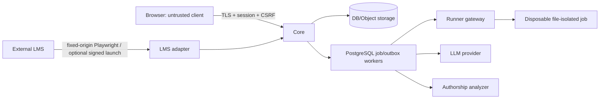

# Безопасность, надёжность и эксплуатация

> Статус: документ задаёт threat model и production target, а не сертификат
> текущего deployment. Baseline реализует object authorization, sessions/CSRF,
> Playwright Moodle login, AES-GCM encrypted leased browser state, hash chains,
> server deadlines, transactional Moodle outbox и HMAC runner. Runner временно
> работает как unrestricted subprocess внутри отдельного контейнера.
> Pen test, Linux sandbox contract suite, real Moodle
> staging, load/SLO, PITR/restore rehearsal, SBOM/signing, full telemetry и
> retention cleanup ещё не подтверждены либо не реализованы.

## 1. Модель угроз

Система одновременно обрабатывает непроверенный C/C++ код, экзаменационные
дедлайны, оценки, историю действий и credentials интеграций. Для interim v1
владелец сознательно принимает отсутствие per-job sandbox; runner-контейнер,
LMS connector и AI всё равно образуют отдельные trust boundaries.

### 1.1. Защищаемые активы

- внешняя identity и course membership;
- административный токен, Moodle browser session state,
  credential-encryption key и connector/service secrets;
- исходный код, история редактирования и snapshots;
- hidden tests, reference solutions и рубрики;
- оценки, комментарии и история решений;
- персональные данные, groups и accessibility accommodations;
- целостность server time, deadline и submit receipt;
- доступность IDE во время контрольной/экзамена;
- инфраструктура core, DB, object storage и runner nodes.

### 1.2. Потенциальные нарушители

- студент, пытающийся расширить доступ, изменить историю или обойти ограничения;
- пользователь с валидной внешней identity/local session и украденным
  административным токеном;
- скомпрометированный браузер/extension;
- вредоносный student program;
- внешний LLM/analyzer либо утёкший provider credential;
- атакующий из сети, включая SSRF через course URL;
- ошибочно настроенный или скомпрометированный Moodle connector;
- разработчик/оператор с избыточным production access;
- случайная ошибка преподавателя в сроках, mapping или оценке.

### 1.3. Границы доверия

Ни browser, ни Moodle callback parameters, ни student files, ни model output не доверяются без независимой серверной проверки.

Текущий поток проще диаграммы: deadline/sync workers обслуживают DB/Moodle;
interactive runner, AI и authorship HTTP вызываются из FastAPI request flow после
короткой DB transaction и сохраняются отдельной транзакцией. S3/Redis/external
broker и WebSocket отсутствуют.

## 2. Реестр ключевых рисков

| Риск | Уровень до мер | Основные меры | Проверка |
| --- | --- | --- | --- |
| Выполнение произвольного кода на общем kernel/runner host | критический, принят | separate unprivileged container, no app/secrets mounts, quotas; per-job sandbox/gVisor deferred | local-runner limit tests + signed risk acceptance |
| Подмена внешней identity/role | критический | authenticated Moodle page/identity, exact origin и external course roles validated; bridge assertion optional | invalid-session/origin/role conformance tests |
| Утечка Moodle password/session | критический | password transient и не сохраняется; exact HTTPS origin; sanitized `storage_state` AES-GCM at rest и только server-side | log/trace scan, state filtering, ciphertext tamper/key rotation tests |
| Утечка общего admin token | высокий | Argon2id hash, short elevation, audit; proxy rate limit временно; rotation/global revoke target | secret scanning, brute-force and replay tests |
| IDOR: студент читает чужую сдачу | критический | object-level authorization по external principal/course membership на каждом endpoint | automated authorization matrix |
| SSRF через ссылку курса | высокий | provisioned connection, exact HTTPS origin, known route parser, no generic fetch/redirect; bootstrap origin review | URL corpus + config review |
| Подмена истории/времени | высокий | server sequence/time, hash chain, idempotency, immutable final snapshot | property/fault tests |
| Race около deadline | высокий | server-authoritative state machine и DB transaction/lock | boundary tests с clock control |
| Archive traversal/symlink/device abuse | высокий | safe manifest parser, path normalization, no `extractall`, file/type/size limits | malicious archive corpus |
| Выдача hidden data через AI | высокий | context separation, allow-listed retrieval/tools, output gate, evals | prompt-injection regression suite |
| Ошибка/повтор LMS mutation | высокий | Quiz Essay transactional outbox/idempotency; Playwright grade/comment write адресует точную штатную форму и требует exact scale; staging read-back остаётся обязательным | retry/mismatch tests + staging conflict risk |
| Падение LMS во время экзамена | высокий | core не зависит от LMS после start, local submit, delayed outbox | game day с отключением Moodle |
| Supply-chain compromise | высокий | lockfiles, signed images, SBOM, scanning, provenance, patch SLA | CI policy and periodic audit |

Реестр уточняется после threat-model workshop и пересматривается перед каждым значимым релизом.

Supply-chain controls в этой строке — target. Baseline содержит
`frontend/package-lock.json`, но Python dependencies backend в
`requirements*.txt` и runner в `pyproject.toml` заданы диапазонами без полного
exact/hash lock. Signed images, SBOM/provenance и доказанная reproducible Python
build отсутствуют и остаются production gate.

### 2.1. Явно принятое исключение `RISK-RUNNER-001`

Владелец продукта временно выбрал `UNRESTRICTED_CONTAINER`: обычный subprocess
без per-job filesystem/network sandbox. Код может читать доступные runner-
контейнеру файлы и использовать его сеть. Компенсирующие меры: отдельный
unprivileged runner-контейнер без application/DB/Moodle/AI mounts и Docker
socket, read-only rootfs, private tmpfs, clean child environment, resource
limits и audit. Перед high-stakes production это исключение должно быть
подписано named risk owner; иначе включается `FILESYSTEM_ONLY`/`HARDENED` либо
отдельный runner host.

## 3. Внешняя аутентификация

### 3.1. Основной pluginless-принцип

- регистрация, локальный пароль и восстановление пароля отсутствуют;
- browser передаёт Moodle username/password только в HTTPS body core;
- backend передаёт credentials только отдельному внутреннему `moodle-browser`
  через HMAC-SHA256 request с timestamp/nonce/body hash;
- worker открывает штатную HTML login form только exact provisioned HTTPS
  Moodle origin, блокирует foreign origins и проверяет authenticated identity;
- password не сохраняется в БД/файлах/browser storage и не попадает в
  application, access, error, audit или trace logs;
- очищенный Playwright `storage_state` ограничивается exact origin, проверяется
  по размеру/структуре и хранится только server-side как AES-GCM ciphertext с
  новым nonce и associated data `(connection_id, principal_id,
  BROWSER_STATE_V1)`;
- identity key — `(connection_id, immutable_external_subject)`, не ФИО/e-mail;
- роли и memberships приходят из Moodle administration options/roster и имеют
  course scope; unknown никогда не повышается до `TEACHER`;
- после Moodle identity verification создаётся случайный server session ID в `HttpOnly
  Secure SameSite` cookie; он не ротируется при elevation в baseline;
- чувствительные POST/PATCH/DELETE требуют CSRF и allowed Origin.

Plaintext password существует в памяти только на время одного request и одного
browser login. Он не используется для автоматического re-login. Между
операциями используется только encrypted state; истёкшая Moodle session требует
повторного ввода credentials. Playwright является явным default transport, а не
молчаливым fallback. Опциональный bridge connection может вместо credentials
endpoint использовать HMAC launch со всеми
issuer/audience/state/verifier/nonce/time/replay проверками.

### 3.2. Moodle browser-state encryption и lifecycle

- production задаёт отдельный стабильный `MOODLE_CREDENTIAL_ENCRYPTION_KEY` не
  короче 32 символов; `run_eduprog.sh` генерирует 64 hex chars и сохраняет их в
  runtime-файле с mode `0600`;
- AES-GCM обеспечивает confidentiality и integrity; ciphertext versioned, а
  invalid tag/wrong key дают fail-closed reauthentication;
- `storage_state` никогда не возвращается frontend и не записывается в outbox
  receipt;
- decrypt выполняется только после authorization и успешного DB lease; revision
  не позволяет сохранить устаревший state поверх нового;
- expired/invalid session state помечается неактивным и требует повторного входа;
- backup БД без encryption key неполон; key хранится/восстанавливается отдельно;
- rotation требует controlled reauthentication либо отдельной re-encryption
  процедуры. Нельзя просто заменить key и считать старые rows доступными.

### 3.3. Freshness внешних memberships

Ниже — target freshness policy. Baseline периодически синхронизирует roster в
`course.sync` и повторно проверяет текущую активную DB membership при workspace,
manual submit, AI и teacher actions; live-call в Moodle на каждую critical
mutation и inbound revoke webhook отсутствуют.

- pluginless login/discovery обновляет courses/roles немедленно;
- active exam запоминает start authorization, но отзывает доступ при явно полученном suspend/revoke event согласно утверждённой политике;
- teacher read/write actions требуют membership snapshot моложе настроенного TTL или live validation при критической операции;
- outage policy различает уже начатую student attempt и новый teacher administrative action;
- неизвестная/неоднозначная external role не маппится в `TEACHER`.

## 4. Административный токен

### 4.1. Семантика

Токен — второй фактор для `SYSTEM_SETTINGS` в уже внешне аутентифицированной сессии. Он не является третьей ролью, паролем пользователя, API key frontend или способом войти без Moodle.

### 4.2. Минимальные меры для первой версии

Baseline реализует Argon2id verifier, generic error, server-session-bound
elevation, привязку elevation к client network prefix (`/24` IPv4, `/64` IPv6),
idle/absolute expiry, explicit revoke/logout и audit системных
изменений. Admin token в pluginless login входит в атомарные DB-backed лимиты
username/network. Для отдельного post-login elevation endpoint distributed rate
limit/progressive lockout, secret-manager pepper, key-version rotation и global
revoke ещё не реализованы; внешний reverse proxy должен временно rate-limit
этот endpoint.

При смене client network prefix middleware отзывает только `SYSTEM_SETTINGS`
elevation. Внешне аутентифицированная LMS-сессия остаётся действующей; это
снижает риск кражи повышенной сессии, не превращая смену сети в полный logout.

- генерировать криптографически случайный secret не менее 256 бит; не использовать слово/обычный пароль;
- хранить в secret manager либо хранить только Argon2id verifier с уникальной salt и server-side pepper;
- сравнивать результат constant-time;
- принимать только в HTTPS body, никогда в URL/header для последующих запросов;
- очищать input сразу; запретить analytics/session replay на login form;
- не писать token, prefix или hash в access/error/audit/trace logs;
- одинаковое внешнее сообщение для неверного token и недоступного elevation;
- rate limit по IP, external principal и deployment; progressive delay и краткий lockout;
- выдавать elevation на рекомендуемые 30 минут неактивности и максимум 2 часа абсолютного времени; итог утвердить ADR;
- поддерживать `current` и временно `previous` key version для безопасной rotation;
- немедленный global revoke закрывает все elevations данной версии;
- каждое чтение/изменение global settings аудируется от имени external principal.

Baseline хранит один Argon2id verifier из deployment config и умеет
grant/revoke elevation/logout. API rotation/current+previous key versions и
global revoke всех уже выданных elevations не реализованы; rotation выполняется
как контролируемая смена secret/config с рестартом и operator audit.

### 4.3. Ограничение подхода

У общего токена нет персональной секретности: его можно переслать, и любой аутентифицированный пользователь с копией получит системные настройки. Audit покажет, кто применил токен, но не кто его раскрыл. Поэтому это допустимый компромисс для первой закрытой установки, а не конечная privileged-access model. Целевое улучшение — индивидуальное назначение administrators во внешнем IdP/LMS плюс MFA/WebAuthn; переход не должен менять две course role.

Токен не решает bootstrap входа. Первое Moodle connection и проверочные ключи provisioned оператором из versioned deployment config/secret references; иначе нет внешнего provider, который мог бы аутентифицировать будущего elevated пользователя.

## 5. Авторизация

- deny by default;
- backend вычисляет effective capability из external course membership, group scope, local availability policy, object ownership, attempt state и optional session elevation;
- `SYSTEM_SETTINGS` не заменяет `TEACHER` для course/review mutations; его
  отдельное глобальное read-only исключение ограничено локальными submissions,
  историей решений и сохранёнными review/integrity evidence;
- teacher review scope строится по общему активному `CourseGroup`; similarity
  peer вне этого scope раскрывается только в авторизованном pair-comparison,
  если другая сторона входит в scope, и не появляется в общей очереди;
- student representation никогда не сериализует hidden tests, reference solution, pool composition или teacher notes;
- signed URL одноразовый/короткоживущий и ограничен конкретным blob/action;
- service credential имеет отдельный principal type и узкие scopes;
- Redis/presence не является источником права; authoritative check выполняется по DB/external revision;
- cached authorization инвалидируется при membership sync, token revoke и logout.

Authorization tests генерируются из матрицы действий: object owner/не owner,
другой курс, общая/чужая группа, stale membership, student с elevation,
read-only admin против mutation, similarity pair с одной/без разрешённой
стороны, teacher без elevation, revoked session и service call.

## 6. Web/client security

- CSP без `unsafe-eval`, strict `script-src`, frame policy согласована с LTI embedding;
- allow-list CORS/origins, HSTS, secure cookies, TLS 1.2+ с предпочтением 1.3;
- output encoding и sanitization task statement/feedback/AI Markdown;
- attachments отдаются как download с безопасным MIME, не исполняются origin приложения;
- anti-clickjacking учитывает только зарегистрированные Moodle frame ancestors;
- request/body/file/output limits до parsing;
- frontend dependency lock через `package-lock.json`; exact/hash lock backend и
  runner Python dependencies, signed images/SBOM и reproducible Python build —
  production target, не baseline claim;
- source maps и debug endpoints не публичны;
- admin/teacher token fields исключены из telemetry, URL и error snapshots;
  Argon2id hash остаётся единственным verifier для teacher login, а AES-GCM
  ciphertext преподавательского token используется только для явного раскрытия
  через `SYSTEM_SETTINGS`. List endpoint не возвращает secret; create/reveal
  responses имеют `no-store`, reveal/replace аудируются без открытого значения;
  по принятому для пилота UX они могут сохраняться origin-scoped в browser
  `localStorage` до явного действия «Забыть сохранённые токены». Это осознанный
  XSS/shared-device риск: production CSP не должен разрешать сторонние scripts,
  а на общем компьютере сохранённые значения необходимо удалять;
- будущий WebSocket должен проверять Origin, session, object capability и
  короткий ticket; baseline использует REST.

Ограничение paste не считается security boundary: DevTools, extensions, второй компьютер и перепечатывание остаются возможны. История даёт свидетельства, но не гарантирует честность.

## 7. Безопасность runner

- runner gateway принимает только content-addressed source bundle и approved profile ID;
- пользователь не задаёт shell command, image, mount, env или произвольные compiler flags;
- build/run происходят вне Uvicorn и application worker processes; отдельный host рекомендован, но не обязателен для принятого v1 risk profile;
- ordinary subprocess видит runner image/network; DB/LMS/LLM/application mounts и Docker socket в контейнер не передаются;
- PID/CPU/wall/memory/file/output limits и kill всего process tree/cgroup остаются обязательны;
- image выбирается по immutable digest и имеет SBOM/signature;
- compile artifacts не переиспользуются между пользователями без content/policy isolation;
- stdout/stderr очищаются от terminal control sequences и усекутся с явным flag;
- private workspace уничтожается после run; result связан с exact snapshot/toolchain/test hash и filesystem-policy version.

Текущий `UNRESTRICTED_CONTAINER` не является файловой или network boundary.
Core/runner не получают Docker socket; gVisor/microVM/`FILESYSTEM_ONLY` остаются
последующим усилением.

Official hidden-test evidence добавляет отдельную DoS/целостностную границу:
только внешний teacher курса с active owned claim, published manifest и
immutable snapshot; mock/local-unisolated result отвергается. Defaults — 8 с
wall/2 с CPU на case, 50 с total, один concurrent report/teacher, 5 reports за
300 с и stale recovery 120 с. Partial results durable, один submission/snapshot
имеет не более одного `RUNNING` report, optional idempotency key не запускает
дубликат. Infrastructure failure сохраняется отдельно и никогда не применяет
grade.

## 8. Безопасность LMS-коннектора

- `LMSConnection` bootstrap выполняет deployment CLI; elevated system settings
  управляют allow-list origins, но connector CRUD UI/API ещё нет;
- course URL parser не делает network fetch/redirect, запрещает userinfo и
  требует exact origin provisioned connection; raw IP/port policy проверяет
  оператор при bootstrap;
- непустой `allowed_lms_origins` дополнительно сужает enabled connections;
  пустой не расширяет их и оставляет connection records allow-list;
- pluginless browser operations используют только exact provisioned HTTPS base
  URL; foreign-origin requests/service workers/downloads блокируются, а
  response/time/concurrency limits bounded;
- username и network используются в rate-limit audit только как keyed hashes;
  password/cookies/state не попадают в audit;
- browser API принимает только узкие typed operations, не произвольные URL,
  selectors или JavaScript;
- roles извлекаются из Moodle и не принимаются от frontend;
- per-user sanitized `storage_state` AES-GCM encrypted at rest и обновляется под
  revision/lease; общий service token не нужен в pluginless mode;
- optional bridge launch использует TLS/HMAC/state/verifier/timestamp/nonce/replay;
  inbound webhook/mTLS отсутствует;
- baseline secrets приходят из env/secret injection; reference store и rotation
  API — target;
- inbound data schema/size/version validated;
- outbox идемпотентен, работает через короткий DB lease и сохраняет bounded
  receipt; локальный snapshot остаётся authoritative при Moodle outage;
- pluginless Quiz sync требует explicit mapped `mod_quiz`, ровно один Essay и
  доказанный `ESSAY_ATTACHMENT` либо `ESSAY_ONLINE_TEXT`. Для attachment
  проверяются safe paths и отсутствие symlink/traversal; online text обязан
  быть однофайловым UTF-8. SHA-256, 4 MiB decoded artifact и 6 MiB signed
  request проверяются до mutation в обоих режимах;
- `PERIODIC`/`FINAL_MINUTE` допускают только `DRAFT_SAVED`, а
  `SUBMISSION`/`DEADLINE` — только `FINALIZED`; inconsistent receipt fail-closed;
- durable idempotency intent хранится в outbox, но browser cache process-local;
  ambiguous final response после restart требует staging validation и не имеет
  заявленной exactly-once гарантии;
- новый ответ стандартного Assignment поддерживает только заново доказанный
  `ASSIGN_FILE`/`ASSIGN_ONLINE_TEXT` transport. При overwrite одного managed
  filename browser-worker требует unique same-origin attachment URL и
  exact-byte SHA-256, совпадающий с durable receipt; отсутствие доказательства
  блокирует mutation. Fixtures/tests не отменяют отдельный live
  capture/save/finalize/read-back staging acceptance;
- Playwright grade/comment route проверяет exact target/form и записывает
  решение для однозначного Assignment либо Quiz Essay через durable outbox.
  Read-back/conflict engine ещё не реализован; неоднозначная форма блокируется.
  Task mirror не enqueue-ится и доступен только optional bridge;
- optional bridge canonical checkpoint/task JSON создаёт Python backend; PHP
  проверяет valid JSON и SHA-256 exact bytes без runtime-dependent re-encoding;
- Moodle DB напрямую не изменяется;
- один `moodle-browser` держит один Chromium и bounded queue; на операцию
  создаётся короткоживущий context, persistent context на пользователя нет.

Optional plugin 0.3 имеет privacy provider для checkpoint rows, но не `backup2` steps
для course backup/restore. Site DB backup обязателен, а course-copy поведение не
считается поддержанным до отдельной реализации и staging-теста.

Исторический аудит видел косвенные признаки Moodle 4.2.2; текущая версия не
подтверждена. Публичная сверка 24 августа 2026 года подтвердила endpoints и
course metadata, но не Moodle build. Безопасность ветки 4.2 больше не поддерживается.
Production bridge нельзя вводить, пока администратор не предоставит фактическую
версию/staging и не будет утверждена поддерживаемая target branch либо формально
принят остаточный риск.

## 9. AI, plagiarism и authorship data

- source/comments/stdout являются untrusted prompt data;
- provider получает минимальные pseudonymized snippets;
- student tutor не получает hidden tests/reference/rubric internals;
- provider adapter не предоставляет tools/shell/URL fetch;
- provider secret только на server side FastAPI; отдельного AI/authorship worker
  baseline пока нет;
- output проходит schema validation и policy gate;
- external analyzer получает bounded pseudonymous manifest через прямой HTTPS
  request с bearer или HMAC; callback/signed URL baseline не реализует;
- probability не вызывает автоматическое наказание;
- после каждой подтверждённой LMS-доставки сохраняются MD5 (требование
  совместимости) и SHA-256 точного артефакта; решение о совпадении принимает
  только SHA-256. Для Essay сравнивается полный канонический текст с сохранением
  внутренних пробелов/табуляции, для файла и ZIP — исходные байты;
- digest не возвращается клиенту и не считается доказательством личности.
  Зелёный/жёлтый/красный статус происхождения лишь помогает преподавателю
  заметить прямую сдачу или замену ответа в Moodle;
- raw provider payload имеет более короткий retention, чем teacher decision;
- договор/политика университета должны разрешать внешнюю передачу кода до включения cloud provider.

## 10. Данные, privacy и retention

До production владелец данных утверждает:

- перечень и правовое основание обработки;
- сроки для profile projection, attempts/history, chat, AI raw data, audit и backups;
- кому доступны exports и апелляционные данные;
- процедуру исправления внешнего профиля через LMS;
- deletion/anonymization после срока, включая object storage и vector indexes;
- geographic/data-processing ограничения внешних providers;
- уведомление студенту о history/authorship/plagiarism processing.

Технический default до решения: решения и история — срок обучения плюс один учебный год; raw AI provider payload — не более 90 дней; audit — не менее двух лет. Это проектная рекомендация, не юридическое заключение.

Важное ограничение: `retention_days` сейчас лишь сохраняется в system settings.
Автоматического cleanup/anonymization job нет; ни одно значение не удаляет
данные. До реализации проверенного job применяется только утверждённая ручная
операторская процедура с backup и audit.

Шифрование: TLS in transit, storage/database backups at rest, отдельные keys/secrets, rotation и least-privilege access. Production data не копируется в development; staging course anonymized.

## 11. Надёжность и режимы деградации

### 11.1. Рекомендуемые SLO для пилота

| Показатель | Цель |
| --- | --- |
| Доступность core в согласованное экзаменационное окно | не ниже 99,9% |
| Edit acknowledgment p95 при штатной нагрузке | ≤ 500 мс; целевое ≤ 300 мс |
| Потеря server-acknowledged edit events | 0 |
| Submit receipt p95 | ≤ 2 с без учёта асинхронного LMS export |
| Deadline clock divergence, видимая клиенту | ≤ 1 с после sync |
| Quiz Essay answer outbox delivery | ≤ 5 минут штатно; eventual retry при outage |
| Grade/comment outbox delivery | ≤ 5 минут штатно; staging SLO утверждается после write/read-back приёмки |
| Critical alert detection | ≤ 2 минуты в экзаменационном режиме |

SLO утверждаются после нагрузочного теста на реальном sizing.

### 11.2. Зависимости

- после старта попытки Moodle outage не блокирует edit/run/local submit;
- новый login и course discovery могут быть недоступны без Moodle либо после
  expiry/revoke browser session — UI сообщает о необходимости повторного входа;
- runner outage не блокирует edit/submit;
- AI/analyzer/plagiarism outage не блокирует ручную проверку;
- primary DB outage является core-critical; object storage в baseline не
  используется;
- job/outbox backlog не должен задерживать timer/deadline/edit ack: подтверждение редактирования и локальная сдача не ждут внешних workers.

### 11.3. Транзакции и worker leases

- каждый HTTP request и каждая worker iteration получает собственный SQLAlchemy `AsyncSession`; один session нельзя разделять между конкурентными asyncio tasks;
- порядок блокировок для workspace state machine фиксирован и одинаков во всех путях: Attempt → Workspace → зависимые rows;
- deadline, submit, reopen, review claim/decision и idempotency transitions перечитывают authoritative state после `SELECT ... FOR UPDATE`;
- sync workers забирают outbox rows через `FOR UPDATE SKIP LOCKED`, записывают owner/lease/attempt и сразу завершают транзакцию;
- Moodle, AI, analyzer и runner HTTP-вызовы никогда не выполняются при удерживаемом row lock или открытой долгой DB transaction;
- receipt/failure записывается новой транзакцией только если lease всё ещё принадлежит worker; stale lease можно безопасно вернуть в очередь;
- scheduler использует PostgreSQL advisory lock и остаётся идемпотентным: второй экземпляр не должен дважды завершить попытку либо создать другой terminal checkpoint;
- business mutation и её outbox event фиксируются одной транзакцией; внешняя доставка всегда at-least-once и требует idempotency key/revision check.

### 11.4. Backup и disaster recovery

Ниже — production target. Compose baseline предоставляет persistent PostgreSQL
volume и документированную `pg_dump`; WAL/PITR, replica, encrypted backup store и
автоматизированная restore rehearsal должны быть добавлены инфраструктурой.

- PostgreSQL: ежедневный full/base backup + continuous WAL/PITR, регулярная restore rehearsal;
- будущий object storage: versioning/replication и lifecycle, manifest scan;
- конфигурация/secret metadata: versioned backup отдельно от secret material;
- `APP_SECRET_KEY` резервируется отдельно и восстанавливается вместе с БД: из
  него с domain separation выводится AES-GCM ключ восстанавливаемых teacher
  tokens. Потеря/несогласованная ротация ключа лишает возможности раскрытия
  ciphertext, хотя сохранённый Argon2id verifier продолжает принимать известный
  token;
- `MOODLE_CREDENTIAL_ENCRYPTION_KEY` резервируется отдельно и восстанавливается
  вместе с БД; Moodle passwords не входят ни в один backup;
- optional Moodle plugin mappings/checkpoints входят в Moodle backup strategy;
- рекомендуемые начальные цели: RPO 0 для подтверждённых edit events при живом primary, disaster RPO ≤ 5 минут, RTO ≤ 60 минут; итог утверждает владелец;
- restore тестируется не только на запуск, но и на reconstruction workspace, submit receipt и sync idempotency.

## 12. Наблюдаемость

Список метрик — target. Baseline имеет health endpoints, DB outbox state,
application/container logs и container healthchecks, но не поставляет готовый
Prometheus/Grafana/OTel/exam dashboard.

Метрики:

- active WebSockets/attempts, edit rate/ack latency/rejections/unacked age;
- DB latency/locks/replication/WAL and storage errors;
- runner queue/start/duration/timeouts/OOM by profile;
- evidence report active/rate-limit/stale/partial/infrastructure outcomes;
- pluginless login/optional launch failures by reason без username, password,
  cookies, `storage_state` и PII;
- admin elevation attempts/success/revoke без token material;
- connector inbox/outbox lag, conflicts, reconciliation drift;
- submit/deadline jobs and receipt latency;
- AI/analyzer latency/error/cost/policy blocks;
- review claims, expiry and collision;
- backup age и последняя успешная restore rehearsal.

Logs структурированы и имеют trace/request/event IDs, но не содержат source code по умолчанию, passwords, cookies, tokens, prompts с PII или hidden tests. Для exam dashboard предусмотрен отдельный low-noise view и synthetic probes.

## 13. Runbooks

Обязательные инструкции оператора:

1. Moodle Playwright login/optional bridge launch недоступен или требует reauth.
2. Quiz Essay answer outbox растёт либо Playwright grade/comment write завершается ошибкой или read-back mismatch.
3. Edit ack latency/DB saturation.
4. Runner backlog/node compromise suspicion.
5. Зависший/массово ошибочный hidden-test evidence report и stale recovery.
6. Submit/deadline job отстаёт.
7. Утечка/подбор admin token: revoke version, close elevations, rotate, audit actors.
8. LLM/provider data incident.
9. Потеря object/blob или mismatch manifest.
10. Восстановление PostgreSQL + object storage до согласованной точки.
11. Продление/перенос экзамена: только утверждённая server-side bulk operation с dry-run и audit.

Каждый runbook содержит owner, severity, detection, безопасные команды/панели, коммуникацию, stop condition, recovery validation и postmortem template.

## 14. Экзаменационный playbook

### За 7–2 дня

- заморозить версии task/test/rubric/build/AI policies;
- проверить external roster/groups/teacher access и время;
- выполнить readiness validation и capacity test;
- прогреть runner images, проверить backups/restore и alert routing;
- проверить минимум двух внешних преподавателей и claim flow;
- подготовить status message и documented fallback.

### За 30 минут

- включить exam dashboard и повышенную on-call готовность;
- проверить DB/storage/queue/runner headroom;
- reconciliation Moodle и clock sync;
- запретить нерелевантные deployments/migrations;
- проверить, что AI policy соответствует экзамену.

### Во время

- не выполнять ручные изменения DB;
- следить за edit ack, active attempts, runner backlog и submit receipts;
- любые массовые overrides проводить через versioned operation с reason;
- Moodle outage не трактовать как потерю работы, пока core healthy.

### После

- сверить submitted/auto-submitted counts и receipt hashes;
- дождаться/reconcile LMS exports;
- сохранить incident timeline и policy versions;
- снять freeze только после подтверждения целостности.

## 15. Среды и выпуск

- `development`: synthetic data, runner без production secrets;
- `integration`: совместный Moodle/bridge contract environment;
- `staging`: анонимизированная копия структуры курса и production-like sizing;
- `production`: change approval, migration plan, rollback/roll-forward и immutable artifacts.

CI gates: unit/integration/property tests, authorization matrix, migrations forward/backward strategy, SAST/dependencies/secrets, image/SBOM scan, connector contract, executor filesystem/limit contract tests, load test baseline и backup restore evidence.

## 16. Критерии security readiness

- threat model подписан владельцами core, Moodle и инфраструктуры;
- нет critical/high открытых findings без формального risk acceptance;
- student с чужими IDs не читает/изменяет чужие объекты;
- Moodle password/cookies/state отсутствуют в browser storage приложения, URL,
  traces и logs; DB содержит только AES-GCM browser-state ciphertext. Временно
  сохранённые admin/teacher tokens допускаются только в origin-scoped
  `localStorage`, не используются как API bearer и должны удаляться на общих
  устройствах;
- admin token без Moodle identity не создаёт session, а elevation не повышает
  course role;
- course URL SSRF suite проходит;
- executor suite не видит application/host data, credentials и соседние job files; network соответствует явно выбранному profile;
- deadline/submit race property tests проходят;
- restore rehearsal достигает RPO/RTO и проверяет workspace hash;
- Moodle outage game day не прерывает уже начатую попытку;
- penetration test и исправления завершены до первого экзамена.

## 17. Полезные первичные источники

- [OWASP ASVS](https://owasp.org/www-project-application-security-verification-standard/)
- [NIST Secure Software Development Framework](https://csrc.nist.gov/Projects/ssdf)
- [gVisor security model](https://gvisor.dev/docs/architecture_guide/security/) — возможное усиление после v1
- [1EdTech LTI Security Framework](https://www.imsglobal.org/spec/security/v1p1/)
