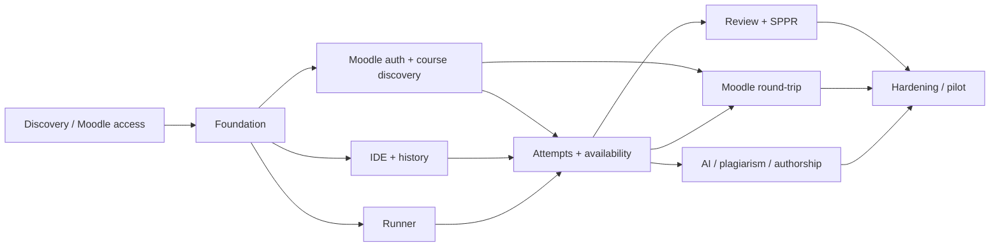

# План реализации, тестирование и приёмка

> Статус: кодовый baseline уже создан, поэтому сроки ниже сохраняются как
> исходная оценка полного production/exam scope, а не как отчёт о затраченном
> времени. Наличие endpoint/test означает «реализовано в репозитории», но не
> «принято»: внешние gates Moodle/Linux/load/security/DR остаются открыты.

## 1. Как читать оценку

Это предварительный план до discovery с администратором Moodle и инфраструктурой. Оценка предполагает:

- 6–8 участников: tech lead/backend, 1–2 backend, 2 frontend, integration/Moodle engineer, DevOps/security и QA automation; преподаватель/product owner участвует регулярно;
- Moodle staging либо отдельный тестовый курс/учётные записи для безопасной
  проверки Playwright flows; установка bridge/LTI не требуется baseline;
- отдельный runner service; для pilot допускается общий physical Linux host при принятом `RISK-RUNNER-001`, для production отдельный host остаётся рекомендуемым;
- один университет/одно Moodle connection в первом production, но generic connector boundary;
- C/C++ как единственный language family;
- отсутствие полной миграции всех исторических артефактов. Baseline уже делает
  bounded read-only импорт финального кода/файлов, оценок и комментариев из
  связанных Quiz Essay/Assignment после LMS sync, но история набора и
  промежуточные состояния в Moodle отсутствуют;

При этих условиях реалистичны:

- **технический пилот лабораторных/самостоятельных:** 18–24 календарные недели;
- **exam-ready production v1 со СППР, Moodle round-trip и принятым облегчённым runner risk:** 30–40 недель;
- **общая трудоёмкость:** ориентировочно 42–56 человеко-месяцев.

Команда из 2–3 разработчиков не сокращает объём: календарный срок приблизится к
14–20 месяцам. Pluginless Playwright не требует доступа администратора Moodle,
но зависит от HTML-разметки и без staging/tests делает round-trip хрупким;
нативный question-bank editor по-прежнему потребует отдельного API/plugin
contract.

### 1.1. Срез, от которого продолжать разработку

| Поток | Код baseline | Что требуется до pilot/production |
| --- | --- | --- |
| Core/auth | FastAPI, sessions/CSRF, две роли, admin elevation | staging SSO, token rotation/runbook, auth matrix |
| Course/Moodle | URL import, roster/groups/activities, scheduled sync, historical import и grade/comment write | real Moodle Playwright parser/write/read-back, revoke/load/fault tests; plugin 0.3 optional |
| Moodle-работы | read-only Moodle metadata, локальное включение для выбранных групп, bounded hidden-test engine как внутренний задел | локальный/native task bank и генерация вариантов скрыты и отложены |
| Attempts | REST history, 64 files/512 KiB, submit/autosubmit/checkpoints | IndexedDB/WebSocket, clock sync, high-load/fault acceptance |
| Runner | GCC/Clang/local subprocess/limits/diagnostics | unrestricted risk sign-off; hardened filesystem/network target, separate host |
| Review | claims, draft/decision, private experiment, synchronous persisted hidden-test reports | realtime presence, sanitizer/static/rubric orchestration |
| Integrity/AI | winnowing, authorship HTTP, student/teacher chat gates и server-side per-mode rate budget | eval/calibration/privacy approval, AST/multi-signal, background SPPR, monetary/token budgets |
| Operations | Compose, health, migrations, pg_dump instructions | TLS/monitoring/PITR/restore/game day/pen test/on-call |

LTI 1.3, native Moodle question-bank two-way editor и automatic retention cleanup
не блокируют development baseline, но должны либо быть реализованы, либо явно
исключены из договора/приёмки production release.

## 2. Объём релизов

### 2.1. Technical alpha

Большая часть code scope этого раздела присутствует, но alpha gate не закрыт без
реального Moodle staging и Linux runner acceptance.

- mock LMS connector и Moodle staging delegated login;
- только две внешние роли, без local registration;
- admin-token elevation для минимальных system settings;
- добавление одного курса по ссылке с discovery preview;
- single-file IDE, server history, internal clipboard receipts;
- compile/run в отдельном runner-контейнере с зафиксированным принятием риска;
- лабораторная без обязательной оценки;
- telemetry, backup baseline и developer deployment.

Alpha не используется для экзамена и не получает реальные hidden/reference materials.

### 2.2. Pilot MVP

Базовые code paths присутствуют; reconnect означает только восстановление
server-ack snapshot после reload, не IndexedDB unacked recovery. Pilot не
разрешён до внешних gates из 1.1.

- Moodle connector v1, roster/groups/sections/activities;
- labs и самостоятельные из Moodle, локальное включение по внешним группам;
- multi-file domain и ограниченный multi-file UI;
- deadline/autosubmit/reconnect/submit receipt;
- базовые tests/diagnostics и закрепление работы за проверяющим;
- grade/comment/checkpoint outbox в Moodle;
- Moodle-owned название, условие, сроки, балл и попытки без локального дубля;
- student lab AI help как feature flag либо отложен без блокировки MVP;
- 30–50 пилотных студентов, не high-stakes exam.

### 2.3. Production v1

Production/exam-ready gate не достигнут. Код уже содержит
laboratory/independent/control/exam presets, GCC/Clang single/multi profiles,
teacher/student AI chat, winnowing, authorship API, review claims и private
experiment. Для production остаются:

- staging-проверка реализованных bounded hidden-test reports и добавление
  sanitizer/static evidence и более полного СППР/rubric orchestration;
- realtime review presence, external grade read-back и conflict UI;
- явно согласованный scope native Moodle question bank либо его исключение;
- capacity, security, DR, privacy, accessibility и exam game days;
- приёмка 100 одновременных экзаменационных attempts на target hardware.

### 2.4. После v1

- второй LMS adapter для доказательства переносимости контракта;
- полноценный clangd pool после измерения памяти;
- custom `qtype_programming_external` и более глубокий bidirectional bank editor;
- индивидуальное privileged access через внешний IdP/MFA вместо общего admin token;
- дополнительные языки и toolchains;
- калиброванный расширенный authorship analyzer;
- optional `HARDENED` runner profile с gVisor/microVM и строгой network/syscall isolation.

## 3. Фазы

Фазы частично перекрываются после стабилизации контрактов. Duration — календарный диапазон работы соответствующего потока, не сумма последовательных сроков.

### Фаза 0. Discovery и решения — 2–4 недели

Результаты:

- утверждённая терминология «LMS wrapper», две роли и отсутствие local registration;
- ADR pluginless login: transient Playwright credentials + encrypted browser state;
- ADR административного токена, rotation и expiry;
- Moodle version/upgrade plan, staging clone и тестовые accounts;
- capability inventory web services/LTI/question bank/Quiz/Assignment;
- anonymized export структуры курса 549;
- source-of-truth matrix и обязательный migration scope;
- threat model, data classification и внешняя AI policy;
- runner infrastructure choice и baseline capacity budget;
- согласованные SLO/RPO/RTO и pilot cohort.

Gate G0: нет допуска интеграции в production, пока не подтверждены Moodle
staging/test-course access и auth/write flow. Plugin access baseline не требует.

### Фаза 1. Engineering foundation — 4–6 недель

- mono-repository structure, environments, CI/CD и artifact provenance;
- FastAPI/ASGI modular skeleton, Pydantic v2 contracts и React shell;
- async SQLAlchemy 2 repositories/Unit of Work, Alembic migrations, PostgreSQL job/outbox и observability;
- generic LMS connector interfaces, fake connector и contract tests;
- external principal/session model, CSRF/CSP/security headers;
- admin elevation, secret rotation/revoke и audit spine;
- health/readiness/status и feature flags;
- initial backup/restore automation.

Gate G1: fake connector проходит conformance suite; token не появляется в browser storage/logs; restore smoke successful.

### Фаза 2. Moodle identity и course discovery — 5–8 недель

- transient Playwright login через штатную Moodle HTML-форму;
- encrypted leased browser `storage_state` без сохранения пароля;
- локальный teacher-token grant; Moodle role не повышает пользователя;
- course URL recognition/SSRF controls;
- discovery sections/groups/memberships/activities;
- import preview, capability report и confirmation;
- delta/reconciliation framework и sync observability;
- local enablement по external Moodle groups.

Gate G2: новый пользователь входит без local account/password; bootstrap-import
course 549 начинает только principal с `SYSTEM_SETTINGS`, Moodle connector
подтверждает target-course enrolment, а роль преподавателя приходит только из
teacher-token grant; confirm включает курс в глобальный allow-list. Обычный
teacher/student без elevation не может начать import. При
новых входах проверяются только предварительно добавленные курсы пользователя,
а roster change отражается без ручного user edit.

### Фаза 3. IDE и доказуемая история — 7–10 недель

- Monaco models/tabs/tree и single/multi-file restrictions;
- WebSocket protocol sequence/ack/backpressure/resume;
- IndexedDB unacked queue и reload recovery;
- semantic edit events, snapshots, hash chain и reconstruction;
- internal clipboard receipts, external paste/drag/drop policies;
- server timer/status panel и read-only lock;
- history playback/diff/export contract;
- accessibility/IME tests.

Gate G3: arbitrary revision reconstructs byte-identical workspace; only server-validated internal paste accepted under strict policy; confirmed changes survive reload/network interruption.

### Фаза 4. C/C++ runner — временно unrestricted; hardened target 4–7 недель

- runner gateway and approved build profiles;
- GCC/Clang immutable images, single/multi-file generated build;
- noninteractive and bounded interactive run;
- сейчас `UNRESTRICTED_CONTAINER` ordinary subprocess с честной metadata;
- затем rootless/mount-namespace `FILESYSTEM_ONLY`, allow-listed toolchain/runtime, private workspace и clean environment;
- CPU/memory/PID/time/output/workspace limits; network default off или явно принятый deployment profile;
- diagnostic normalization/source mapping;
- public/hidden tests, sanitizer and static analyzer modes;
- artifact/result hash linkage;
- filesystem escape/sibling-job/path traversal и resource-abuse test corpus.

Gate G4: filesystem/limit contract tests passed, `RISK-RUNNER-001` подписан, core has no container socket, diagnostics point to exact revision/file/range, result reproducible by snapshot/profile hashes.

### Фаза 5. Attempts, Moodle schedules и сдача — 5–7 недель

- projection Moodle activity, её окна, длительности, балла и числа попыток;
- локальное включение выбранной activity для Moodle-групп преподавателя;
- attempt state machine, server deadline and overrides;
- manual submit/autosubmit/immutable receipt;
- D/10 → D/20 LMS checkpoint scheduler with min/max bounds;
- forced start/finish/<60s/deadline checkpoints;
- offline/degradation messages and outbox retry;
- group availability effective-access preview без локальных deadline override.

Gate G5: clock/race/property tests pass; final snapshot is last accepted-before-deadline revision; Moodle outage cannot lose local submission.

### Фаза 6. Teacher review и СППР — 6–9 недель

Уже реализованный поднабор: hidden-test manifest/editor v1, teacher-only
synchronous report по immutable snapshot, durable partial outcomes,
idempotency/stale recovery, claim/policy gates и отсутствие automatic grade.
Public/visible suites, sanitizer/static и versioned rubric остаются в фазе.

- local task/test/rubric bank остаётся отдельным deferred scope и не блокирует
  Moodle-wrapper flow;
- локальный group enablement без зависимости от answer transport; transport
  проецируется при start attempt и повторно fail-closed проверяется при delivery;
- submission queues/group filters;
- claim/lease/presence/private draft;
- immutable viewer and private editable teacher sandbox with build/run, diagnostics, diff/reset/delete;
- deterministic evidence pipeline;
- final grade/comment revisions and audit;
- per-course SPPR switch.

Gate G6: two teachers cannot concurrently write one decision; AI/evidence never applies grade; every exported decision has external actor, rubric and evidence revisions.

### Фаза 7. Moodle round-trip и legacy mapping — 6–10 недель, перекрывается с 5–6

Уже реализованный pluginless-поднабор: read-only activity metadata projection,
Quiz с ровно одним Essay и стандартный Assignment для answer draft/final,
исторический импорт Quiz Essay/Assignment и grade/comment write через штатные
формы по точным внешним идентификаторам. Transport проверяется по фактической
student form непосредственно перед mutation; independent grade
read-back/conflicts, native question bank, webhooks и Moodle course `backup2`
support остаются в фазе. Full recovery checkpoint и connector-owned task mirror
доступны только optional plugin и не входят в основной wrapper flow.

- mappings for selected native Assignment/Quiz Essay;
- task/question/category/version/random-pool import — отдельный будущий scope;
- activity settings остаются Moodle-owned; оболочка их не отправляет;
- независимый grade/comment read-back, conflict detection и reconciliation UI;
- per-question marks/comments where required;
- checkpoint payload/attachment strategy;
- webhook/task outbox/inbox, conflicts and reconciliation UI;
- backup/restore/course-copy mapping tests;
- compatibility CI for supported Moodle branches.

Gate G7: retry/duplicate/out-of-order operations do not duplicate or overwrite grades; unsupported fields are visible; course restore does not reuse old mappings.

### Фаза 8. AI, plagiarism и authorship — 6–9 недель, feature-flagged

- provider abstraction and structured outputs;
- student tutor policy/input-output gates/citations;
- teacher chat and background SPPR recommendation;
- winnowing baseline enhanced by AST/multi-signal candidates;
- starter/common code exclusion and side-by-side case UI;
- versioned authorship export/callback and probability explanation;
- cost/privacy controls, retention jobs and eval harness;
- Russian/English jailbreak and leakage regression suites.

Gate G8: policy eval target reached; no hidden/reference leak in regression set; probability cannot trigger automatic grade/action.

### Фаза 9. Hardening и pilot rollout — 5–7 недель

- load/soak/fault/security/accessibility tests;
- penetration test and remediation;
- backup restore and Moodle outage game days;
- exam dashboard/runbooks/on-call training;
- teacher training and anonymized rehearsal;
- 10-user internal pilot, then 30–50 student pilot;
- measurement, defect burn-down and go/no-go review;
- 100-attempt exam rehearsal with 2× edit-ingest headroom.

Gate G9: acceptance suite, risk sign-off, restore evidence, support rota and rollback plan complete.

## 4. Критический путь и параллелизм

Самый опасный внешний dependency — доступ администратора Moodle и обновление 4.2. Runner/IDE можно разрабатывать параллельно с fake connector, но production login, memberships, question bank и grade round-trip нельзя честно завершить без staging/plugin/API.

## 5. Команда и ownership

| Направление | Основной owner | Обязательное участие |
| --- | --- | --- |
| Product/rules/rubrics | преподаватель-product owner | методкомиссия, QA |
| Core/domain/API | tech lead + backend | security, frontend |
| Moodle connector/plugin | integration engineer | Moodle site admin, backend |
| IDE/history | frontend lead | backend realtime, accessibility QA |
| Runner/toolchain | platform/security engineer | C++ преподаватель, backend |
| AI/plagiarism/authorship | backend/ML engineer | product owner, privacy/security |
| QA/acceptance | QA automation | каждый owner |
| Operations/incident | DevOps/SRE | site admin, tech lead |

Для high-stakes экзамена Moodle admin и инфраструктурный on-call не могут быть «по возможности»: роли эксплуатации и время реакции утверждаются заранее.

## 6. Стратегия тестирования

### 6.1. Уровни

- unit: state machines, permissions, interval calculation, path normalization, scoring;
- property-based: edit transforms, hash chain, deadline races, idempotency, grade decimals;
- component: DB/outbox/object store/runner adapter;
- connector contract: generic fake + Moodle adapter;
- integration: LTI/bridge, Quiz/Assignment/question bank, grade round-trip;
- browser E2E: student/teacher/elevated session, reconnect, IME, accessibility;
- security: IDOR/CSRF/XSS/SSRF/replay/archive/filesystem isolation/resource limits/prompt injection;
- load/soak: WebSocket events, runner queue, 60-minute exam and checkpoint bursts;
- disaster: DB/object restore, Moodle outage, worker retry, node loss;
- human usability: преподавательская проверка и студент в IDE.

Tests не зависят от production course. Moodle integration fixture содержит synthetic users, exactly two mapped roles, groups, Assignment, Quiz Essay, random pools, deadlines и conflicts.

### 6.2. Обязательные нагрузочные сценарии

1. 150 connected IDE sessions, 100 active exam attempts.
2. 500 edit events/s steady и 1000/s burst не менее 10 минут.
3. Одновременный reload/reconnect 30% clients.
4. 50 queued compile/run jobs с resource-abuse mix.
5. Submit burst всех 100 attempts в последние 60 секунд.
6. D/10/D/20 checkpoint burst при недоступном Moodle и последующий drain.
7. 10 преподавателей берут работы параллельно без double write.
8. Один runner node и один web replica теряются во время soak.

## 7. Сквозные критерии приёмки

### AUTH

- **AUTH-01:** в UI/API нет регистрации, local password, invite и local role mutation.
- **AUTH-02:** повторный Moodle launch сопоставляется с тем же external principal по stable ID, не по ФИО.
- **AUTH-03:** core принимает только `STUDENT`/`TEACHER`; unknown role denied.
- **AUTH-04:** admin token без внешнего login не создаёт session.
- **AUTH-05:** elevation открывает global settings, но не student code чужого курса.
- **AUTH-06:** token отсутствует в URL, local/session storage, logs, traces и error reporting.
- **AUTH-07:** expiry/revoke/rotation немедленно меняют effective capability.

### CONNECTOR/COURSE

- **CONN-01:** Moodle adapter проходит общий conformance kit.
- **CONN-02:** course URL поддерживаемого origin создаёт discovery preview; неизвестный/опасный URL отклоняется без network fetch.
- **CONN-03:** bootstrap-gate допускает любую active `TEACHER` role либо
  `SYSTEM_SETTINGS`; Moodle 0.3 discovery подтверждает target-course `TEACHER`,
  а после import elevation не даёт course access без membership.
- **CONN-04:** sections/groups/memberships stable IDs сохраняются; ФИО не используются как ключ.
- **CONN-05:** local availability использует external target и не создаёт enrolment.
- **CONN-06:** повторный import/reconciliation идемпотентен.

### IDE/HISTORY

- **IDE-01:** single/multi-file policy соблюдается server-side.
- **IDE-02:** acknowledged revision восстанавливается байт-в-байт после reload.
- **IDE-03:** strict paste принимает только server-valid internal clipboard receipt.
- **IDE-04:** history хранит semantic edits, structural events, origin и server sequence/time.
- **IDE-05:** финальная snapshot/hash неизменяемы.
- **IDE-06:** IME/accessibility input не блокируется общей эвристикой paste.

### RUNNER

- **RUN-01:** student/teacher code не запускается в Uvicorn либо application worker process.
- **RUN-02:** job читает только own declared files и read-only toolchain/runtime; app/secrets/home/sibling-job paths недоступны, запись возможна только в private build/tmp/output.
- **RUN-03:** CPU/memory/PID/time/output/workspace limits останавливают случайный или намеренный resource abuse.
- **RUN-04:** result связан с exact source/toolchain/test/executor-policy hashes.
- **RUN-05:** multi-file semantics сохраняет translation units, include и linking; flatten запрещён.
- **RUN-06:** diagnostics map на exact revision, user file ID, line/column/range без executor paths; locationless linker errors не получают выдуманную строку.
- **RUN-07:** фактическая network policy отражена в result/system settings; `FILESYSTEM_ONLY` не маркируется как kernel-safe.

### ATTEMPT/SUBMIT

- **ATT-01:** только server clock определяет start/end/deadline.
- **ATT-02:** операция, записанная после deadline, не попадает в final snapshot.
- **ATT-03:** manual и auto submit идемпотентны и возвращают immutable receipt.
- **ATT-04:** после deadline code read-only; reopen создаёт audited epoch.
- **ATT-05:** Moodle outage не мешает local submit.
- **ATT-06:** D/10, последняя пятая D/20, finish/deadline/<60s checkpoint rules проверены на граничных duration.

### REVIEW/SPPR

- **REV-01:** активный write claim уникален; viewers read-only.
- **REV-02:** финальную оценку применяет только внешний teacher этого course.
- **REV-03:** evidence/AI/plagiarism/authorship не применяют grade автоматически.
- **REV-04:** teacher sandbox не меняет submission.
- **REV-05:** teacher sandbox поддерживает private edit/build/run, click-to-line diagnostics, diff, reset и delete; experiment history не смешивается со student authorship.
- **REV-06:** decision revision, rubric/evidence IDs, actor и audit неизменяемы.
- **REV-07:** hidden-test report требует exact immutable snapshot, активного
  закрепления работы и реального runner; report сохраняет фактические признаки
  isolation/network, а mock не считается evidence.
- **REV-08:** per-case/total timeout, one-running constraint, per-teacher
  concurrency/rate limit, durable partial result, stale recovery и optional
  idempotency replay проверены; infrastructure failure не становится grade.

### MOODLE SYNC

- **SYNC-01:** Quiz answer и grade/comment retry не создают дубликат; optional
  checkpoint/task-mirror проверяется отдельно только при включённом plugin.
- **SYNC-02:** external concurrent edit создаёт conflict вместо silent overwrite.
- **SYNC-03:** Moodle-owned title/condition/schedule/grade/attempts повторно
  проецируются без локального last-write-wins.
- **SYNC-04:** course copy/restore получает новые mappings.
- **SYNC-05:** unsupported property видна в capability report.
- **SYNC-06:** Moodle outage backlog восстанавливается и read-back подтверждает результат.

Baseline unit/integration tests покрывают идемпотентный outbox и bounded
receipts, но `SYNC-02/03/04/06` не закрыты на реальной Moodle; grade read-back и
native task/question bank отсутствуют.

### AI/INTEGRITY

- **AI-01:** exam student tutor выключен default.
- **AI-02:** student output gate блокирует готовую функцию/решение на утверждённом eval set.
- **AI-03:** citations разрешены и проверяемы; несуществующая ссылка не создаётся как факт.
- **AI-04:** hidden/reference content не входит student context.
- **INT-01:** plagiarism исключает starter/common code и показывает fragments/scores.
- **INT-02:** authorship result показывает uncertainty/version/limitations и требует human disposition.

### OPS/SECURITY

- **OPS-01:** target load выполняется с agreed latency/error budget.
- **OPS-02:** restore rehearsal восстанавливает verified snapshot hashes.
- **OPS-03:** Moodle/AI/runner degradation соответствует документированному режиму.
- **OPS-04:** security review/penetration test не оставляет неприемлемых high findings.
- **OPS-05:** exam runbook отрепетирован людьми, которые будут дежурить.

## 8. Definition of Done для каждого epic

- требования и threat cases связаны с tests;
- API/schema docs и migration готовы;
- object-level permission tests есть для positive/negative scopes;
- observability и alerts добавлены вместе с функцией;
- retries/idempotency/degradation продуманы;
- accessibility keyboard/screen-reader path проверен для UI;
- feature flag/rollback или безопасный roll-forward определён;
- данные/retention/audit классифицированы;
- нет неоформленного provider-specific знания в core;
- runbook обновлён, если меняется production operation.

## 9. Пилот и rollout

1. Synthetic staging и internal teacher rehearsal.
2. 10 добровольных пользователей на неоцениваемой лабораторной.
3. 30–50 студентов на лабораторной с Moodle checkpoint/grade shadow mode.
4. Самостоятельная с параллельным старым способом сдачи как rollback path.
5. Первая контрольная только после post-pilot review.
6. Экзамен — после 100-user rehearsal, penetration fixes и sign-off G9.

Shadow mode сначала сравнивает импорт/оценки, но не изменяет официальный Moodle grade. В write-enabled pilot каждая интеграционная операция имеет feature flag и понятный способ остановить outbox без потери local decisions.

## 10. Go/no-go перед экзаменом

`GO` возможен только если:

- roster/groups и work visibility сверены;
- все required tasks/test/toolchain images immutable и available;
- target load, node-loss и Moodle-outage сценарии прошли;
- backup/restore rehearsal свежий;
- нет critical/high security defects без принятого named-owner risk; `RISK-RUNNER-001` отдельно подтверждён для выбранного deployment;
- submit/deadline reconciliation отчёт чист;
- минимум два преподавателя прошли review/claim rehearsal;
- on-call, коммуникация и fallback утверждены.

Иначе используется ранее согласованный внешний процесс. Нельзя впервые проверять критическую интеграцию на реальном экзамене.
